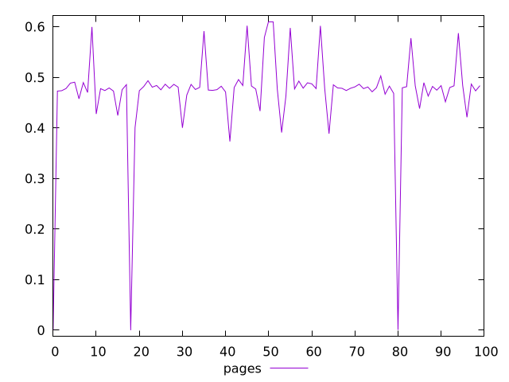
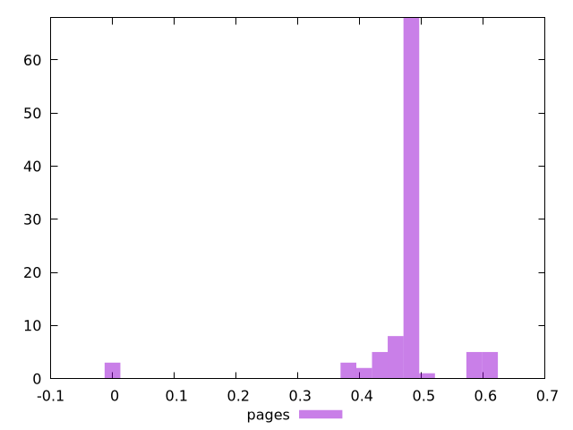
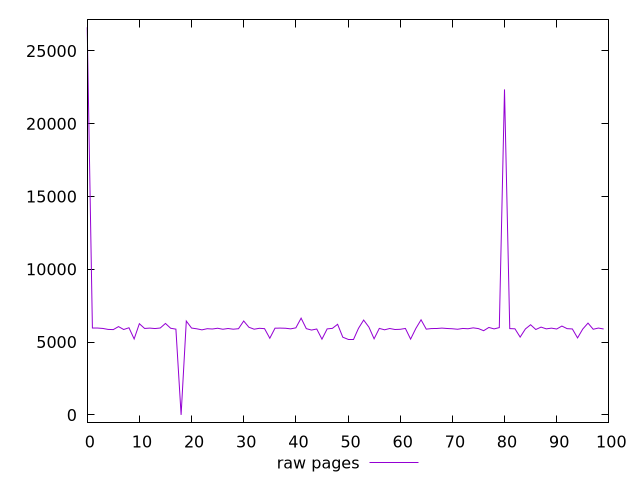
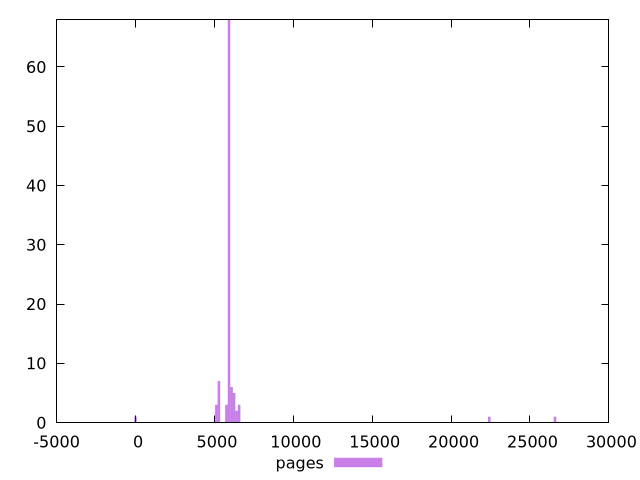

# Report pages

[parent..](./..)  


## Scores

  

## Score Histogram

  

## Score Indicators

```yaml
min: 0
max: 0.6099570751895187
range: 0.6099570751895187
mean: 0.46949524404944165
median: 0.478973707839702
stdev: 0.09343911983448998
skewness: -3.581556985439143

```

## Raw Values

  

## Raw Values Histogram

  

## Raw Indicators

```yaml
min: 0
max: 26626.026427967437
range: 26626.026427967437
mean: 6217.630662976867
median: 5928.874358216811
stdev: 2706.202245163226
skewness: 6.283162255090769

```

<style>
  img {
    max-width: 80%;
  }
</style>
      
