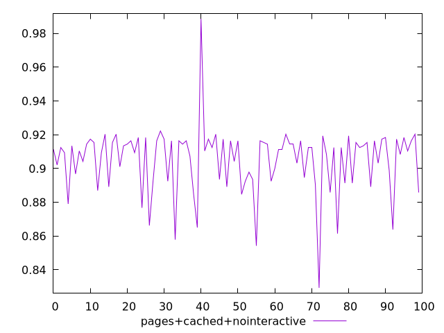
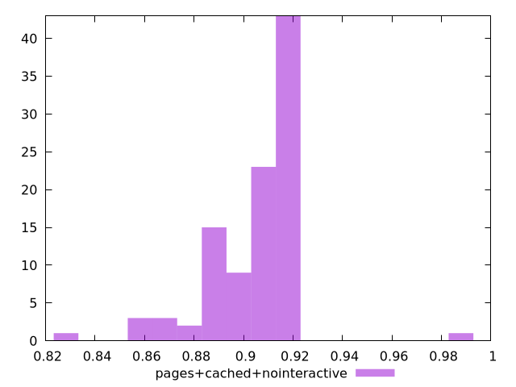
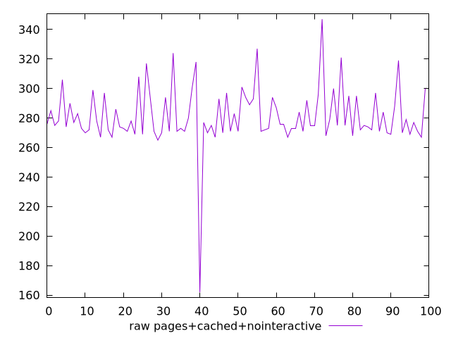
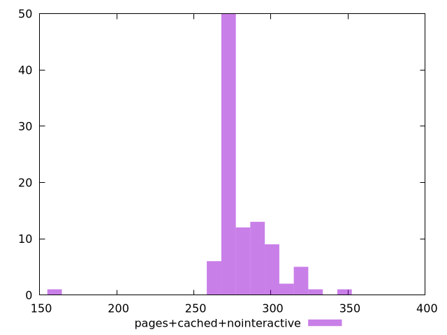

# Report pages+cached+nointeractive

[parent..](./..)  


## Scores

  

## Score Histogram

  

## Score Indicators

```yaml
min: 0.8293600100807806
max: 0.9885586652661822
range: 0.15919865518540155
mean: 0.9050257295055626
median: 0.912414687309443
stdev: 0.01923717984008229
skewness: -0.5466348508424942

```

## Raw Values

  

## Raw Values Histogram

  

## Raw Indicators

```yaml
min: 162
max: 347
range: 185
mean: 281.2899999999996
median: 275
stdev: 19.86770998379026
skewness: -1.26158222652304

```

<style>
  img {
    max-width: 80%;
  }
</style>
      
