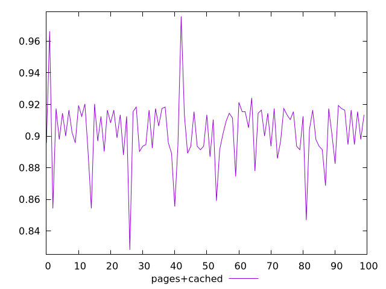
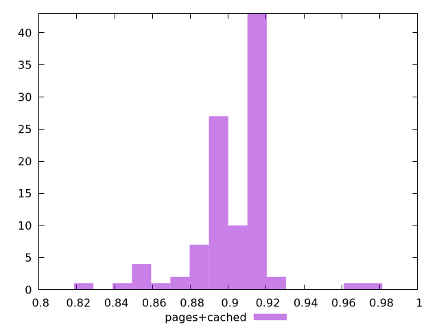
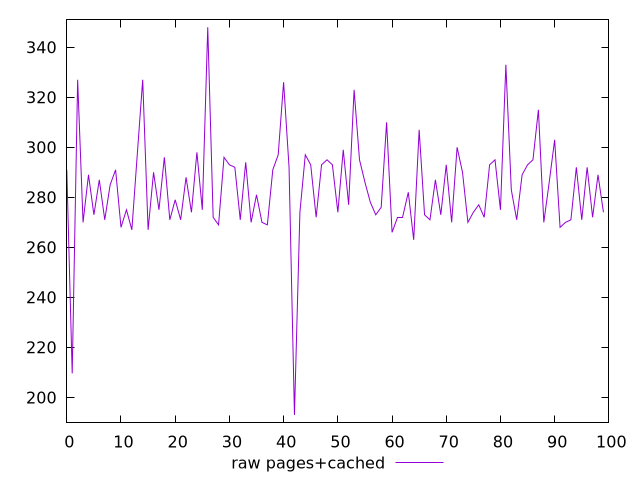
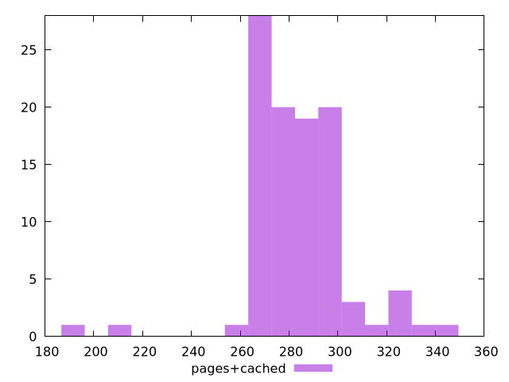

# Report pages+cached

[parent..](./..)  


## Scores

  

## Score Histogram

  

## Score Indicators

```yaml
min: 0.8280884419200208
max: 0.9756441379504823
range: 0.14755569603046148
mean: 0.9026741834575428
median: 0.9057742971031606
stdev: 0.02036954571320179
skewness: -0.43231838744794193

```

## Raw Values

  

## Raw Values Histogram

  

## Raw Indicators

```yaml
min: 193.0000000000009
max: 348
range: 154.9999999999991
mean: 283.55563499999977
median: 281.5
stdev: 20.115428533075608
skewness: -0.5400593698240977

```

<style>
  img {
    max-width: 80%;
  }
</style>
      
