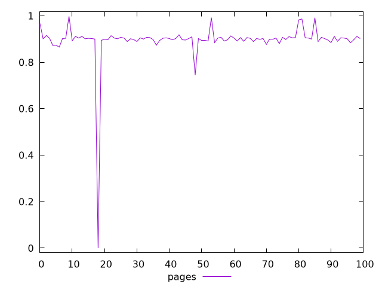
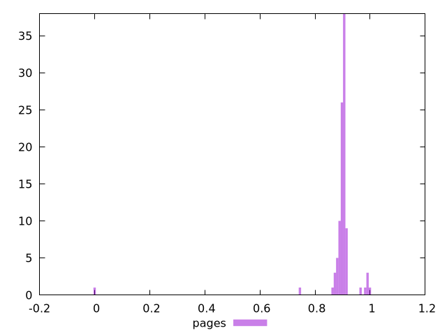
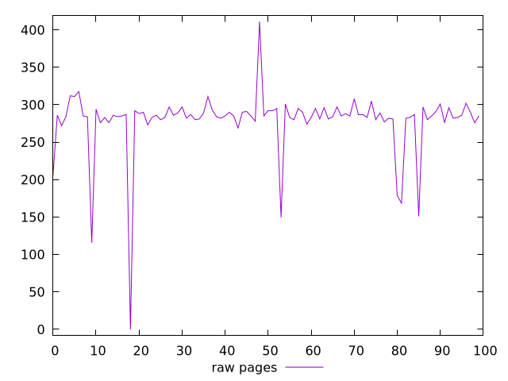
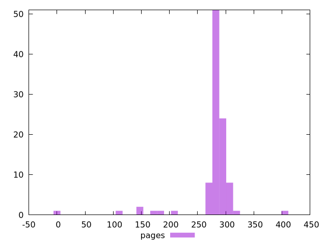

# Report pages

[parent..](./..)  


## Scores

  

## Score Histogram

  

## Score Indicators

```yaml
min: 0
max: 0.9979039090958033
range: 0.9979039090958033
mean: 0.893963315534814
median: 0.9021161263191463
stdev: 0.09405690692636542
skewness: -8.566477384802468

```

## Raw Values

  

## Raw Values Histogram

  

## Raw Indicators

```yaml
min: 0
max: 411
range: 411
mean: 278.318185
median: 285
stdev: 44.36377494429748
skewness: -3.4467424289667536

```

<style>
  img {
    max-width: 80%;
  }
</style>
      
