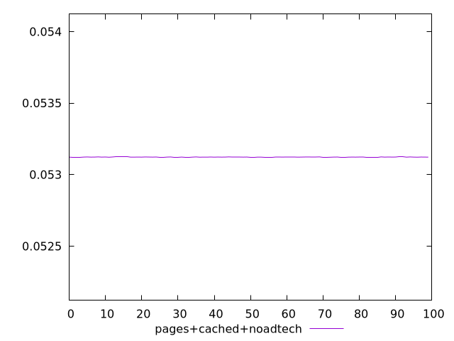
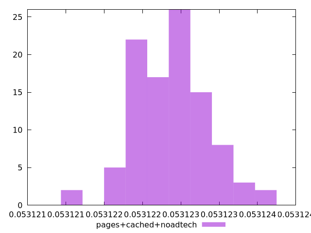
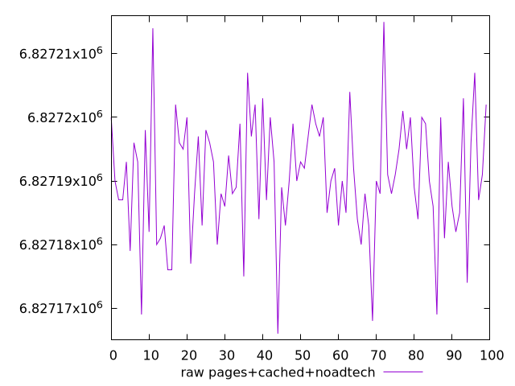
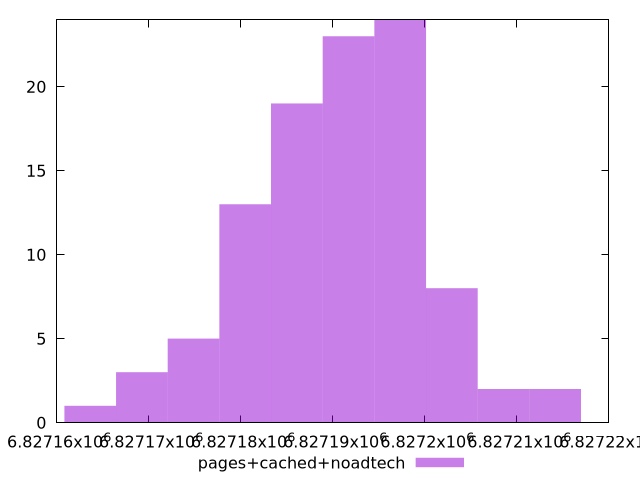

# Report pages+cached+noadtech

[parent..](./..)  


## Scores

  

## Score Histogram

  

## Score Indicators

```yaml
min: 0.053121152229150315
max: 0.05312360806529198
range: 0.0000024558361416682217
mean: 0.0531223751238416
median: 0.053122405193323896
stdev: 4.717592992376593e-7
skewness: 0.18662347137137758

```

## Raw Values

  

## Raw Values Histogram

  

## Raw Indicators

```yaml
min: 6827166
max: 6827215
range: 49
mean: 6827190.6
median: 6827190
stdev: 9.412757300600079
skewness: -0.18659657363326013

```

<style>
  img {
    max-width: 80%;
  }
</style>
      
