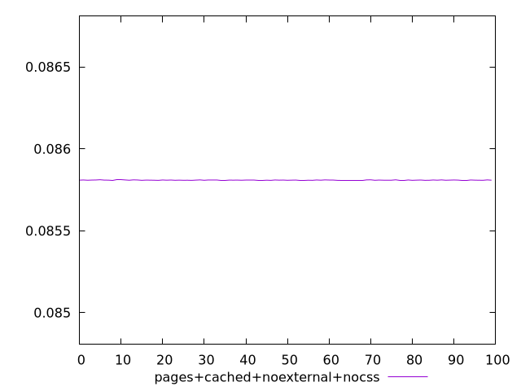
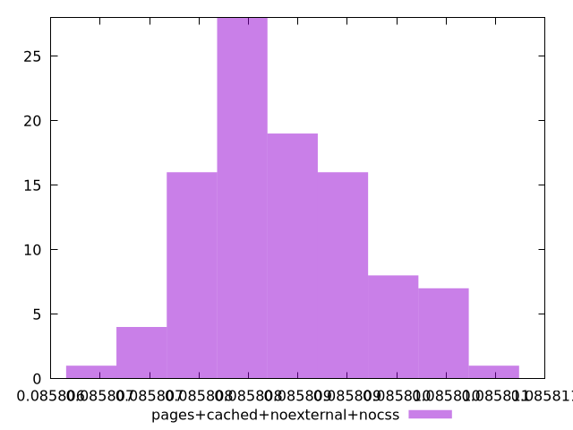
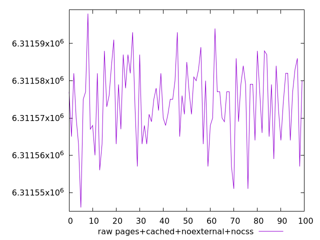
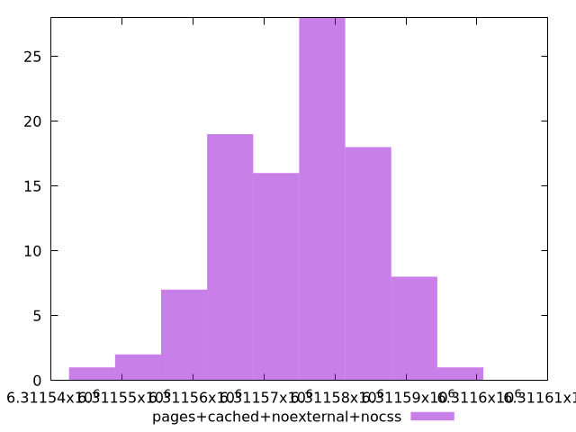

# Report pages+cached+noexternal+nocss

[parent..](./..)  


## Scores

  

## Score Histogram

  

## Score Indicators

```yaml
min: 0.08580700211516151
max: 0.08581108435242712
range: 0.0000040822372656124095
mean: 0.08580885794437394
median: 0.08580872919369831
stdev: 8.116408530121885e-7
skewness: 0.2707158545072248

```

## Raw Values

  

## Raw Values Histogram

  

## Raw Indicators

```yaml
min: 6311546
max: 6311598
range: 52
mean: 6311574.36
median: 6311576
stdev: 10.338781359522022
skewness: -0.27069389957188994

```

<style>
  img {
    max-width: 80%;
  }
</style>
      
