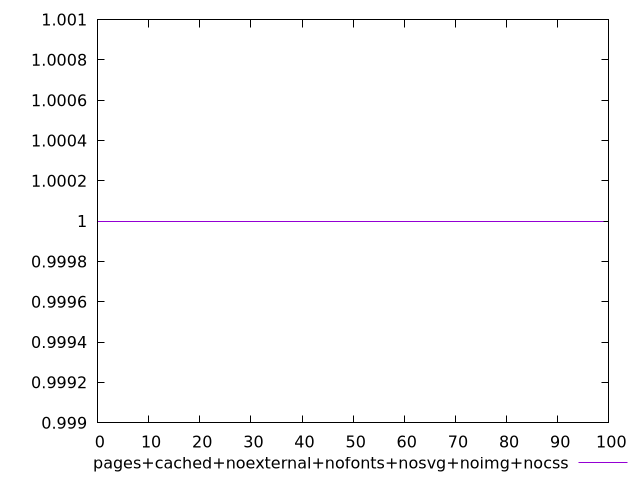

# Report pages+cached+noexternal+nofonts+nosvg+noimg+nocss

[parent..](./..)  


## Scores

  

## Score Histogram

  

## Score Indicators

```yaml
min: 1
max: 1
range: 0
mean: 1
median: 1
stdev: 0
skewness: .nan

```

## Raw Values

  

## Raw Values Histogram

  

## Raw Indicators

```yaml
min: 61919
max: 61932
range: 13
mean: 61925.02
median: 61926
stdev: 2.734885738015396
skewness: -1.4523367161936096

```

<style>
  img {
    max-width: 80%;
  }
</style>
      
