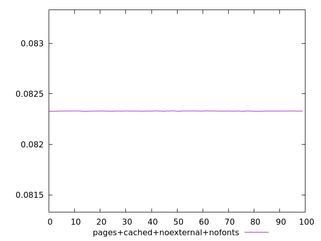
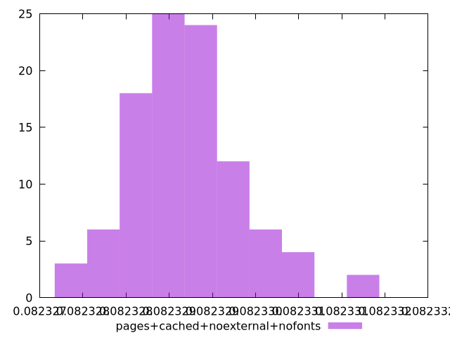
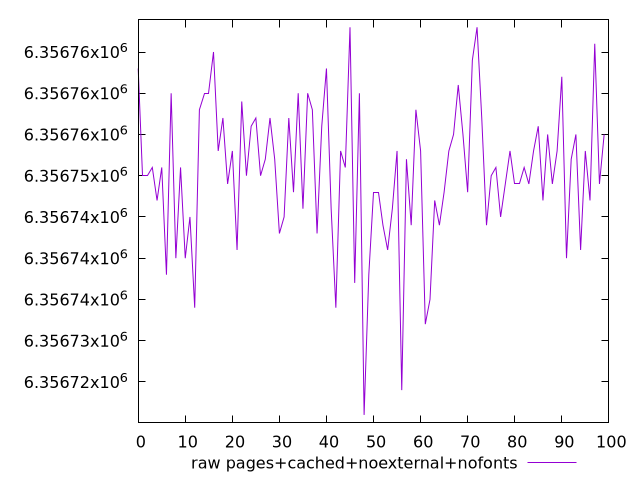
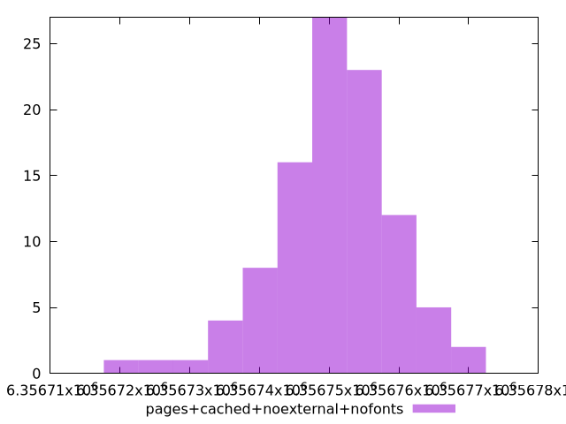

# Report pages+cached+noexternal+nofonts

[parent..](./..)  


## Scores

  

## Score Histogram

  

## Score Indicators

```yaml
min: 0.08232784618598887
max: 0.08233139757986019
range: 0.0000035513938713149784
mean: 0.08232917832226741
median: 0.08232913071636033
stdev: 6.492700417869397e-7
skewness: 0.6271142482734371

```

## Raw Values

  

## Raw Values Histogram

  

## Raw Indicators

```yaml
min: 6356721
max: 6356768
range: 47
mean: 6356750.37
median: 6356751
stdev: 8.59261892556628
skewness: -0.6270855063215284

```

<style>
  img {
    max-width: 80%;
  }
</style>
      
