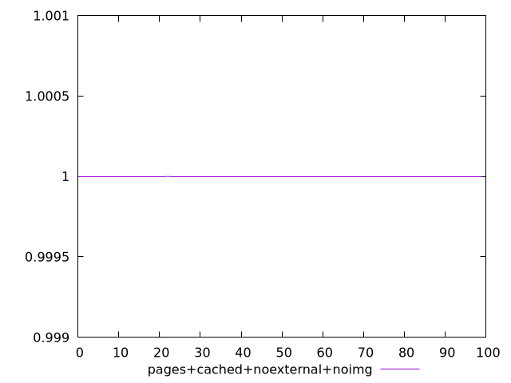
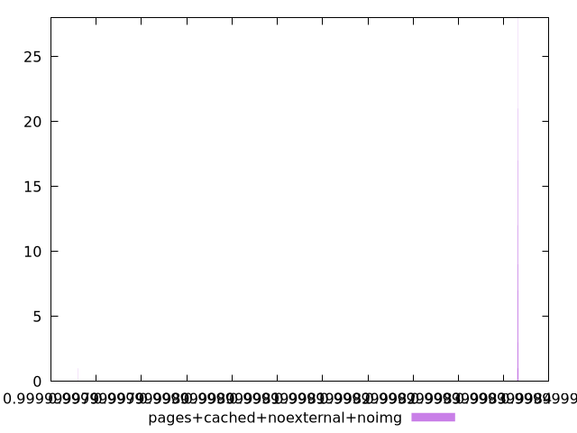
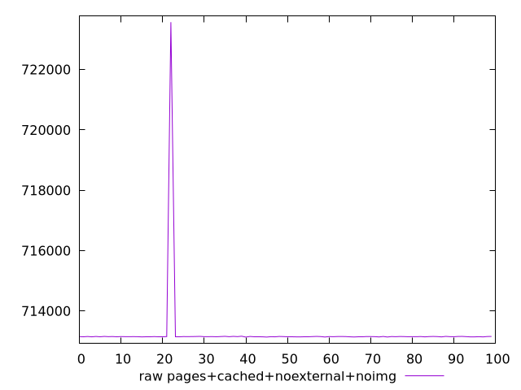
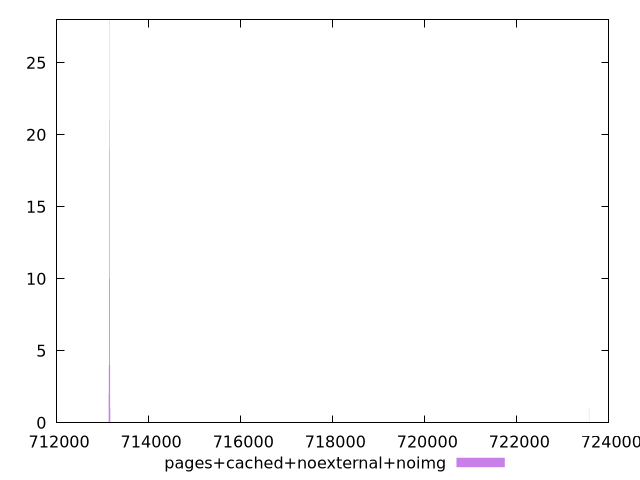

# Report pages+cached+noexternal+noimg

[parent..](./..)  


## Scores

  

## Score Histogram

  

## Score Indicators

```yaml
min: 0.9999999787983638
max: 0.9999999836624358
range: 4.864072034038713e-9
mean: 0.9999999836075816
median: 0.9999999836560403
stdev: 4.833503042313523e-10
skewness: -9.84901314443523

```

## Raw Values

  

## Raw Values Histogram

  

## Raw Indicators

```yaml
min: 713134
max: 723571
range: 10437
mean: 713253.43
median: 713149.5
stdev: 1036.9706384946492
skewness: 9.848910044822041

```

<style>
  img {
    max-width: 80%;
  }
</style>
      
