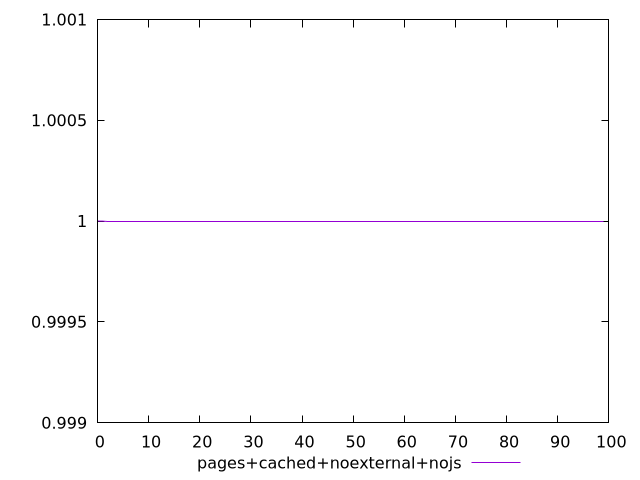
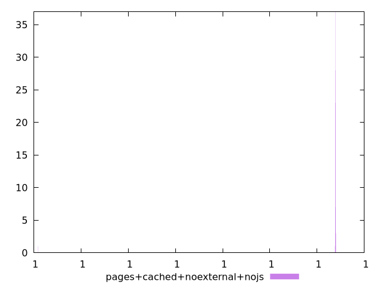
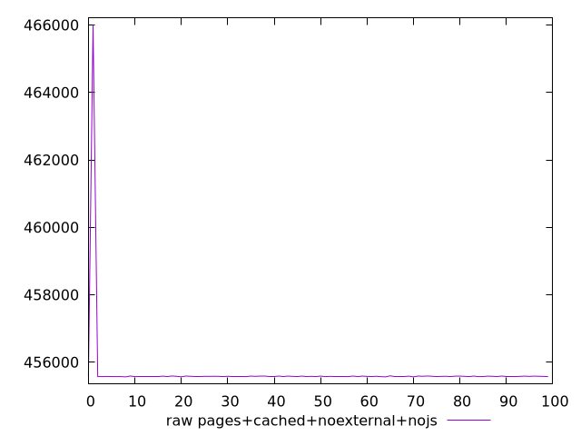
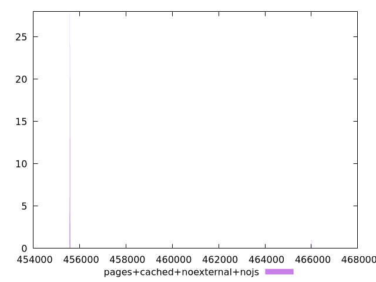

# Report pages+cached+noexternal+nojs

[parent..](./..)  


## Scores

  

## Score Histogram

  

## Score Indicators

```yaml
min: 0.9999999999968174
max: 0.9999999999980786
range: 1.2612133559741778e-12
mean: 0.9999999999980653
median: 0.9999999999980771
stdev: 1.253490126431247e-13
skewness: -9.865735879039159

```

## Raw Values

  

## Raw Values Histogram

  

## Raw Indicators

```yaml
min: 455567
max: 466008
range: 10441
mean: 455685.92
median: 455582
stdev: 1037.4286354251074
skewness: 9.848773001289159

```

<style>
  img {
    max-width: 80%;
  }
</style>
      
