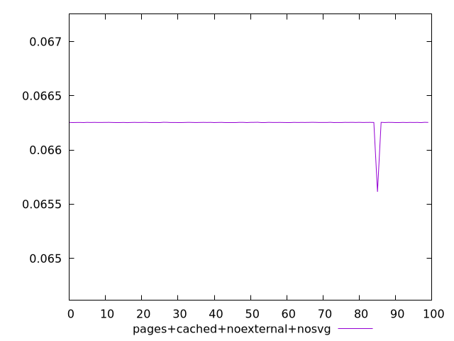
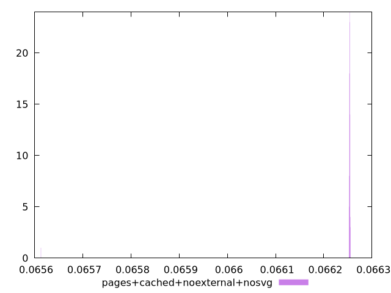
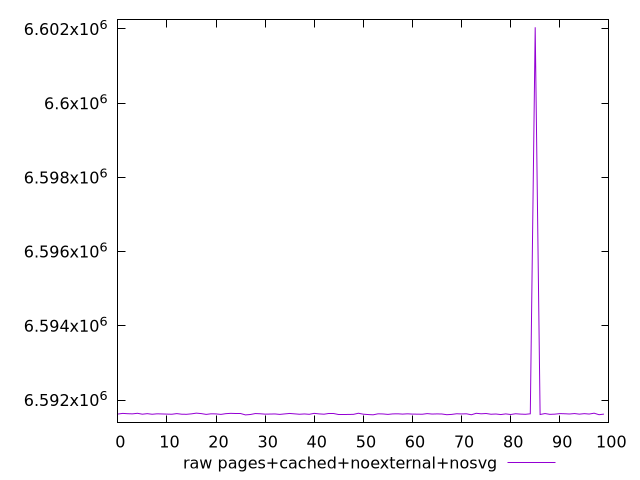
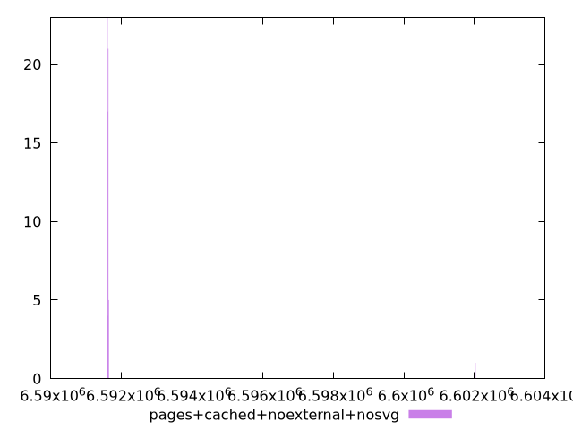

# Report pages+cached+noexternal+nosvg

[parent..](./..)  


## Scores

  

## Score Histogram

  

## Score Indicators

```yaml
min: 0.06561330666729004
max: 0.0662552832292228
range: 0.0006419765619327666
mean: 0.06624736416371546
median: 0.06625370923996571
stdev: 0.00006372814162545425
skewness: -9.847967571099941

```

## Raw Values

  

## Raw Values Histogram

  

## Raw Indicators

```yaml
min: 6591599
max: 6602047
range: 10448
mean: 6591727.77
median: 6591624.5
stdev: 1037.169464022152
skewness: 9.847980277978825

```

<style>
  img {
    max-width: 80%;
  }
</style>
      
