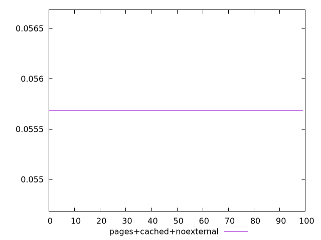
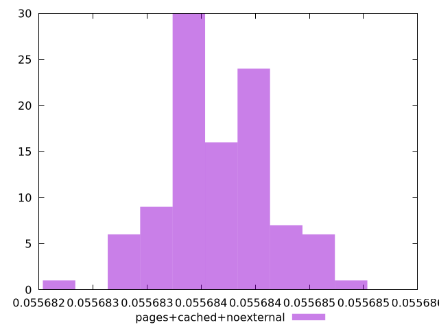
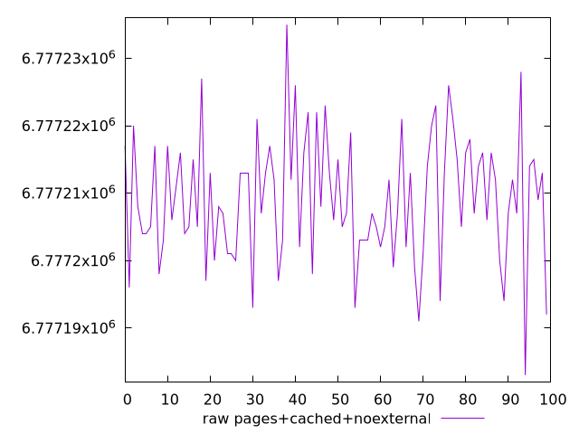
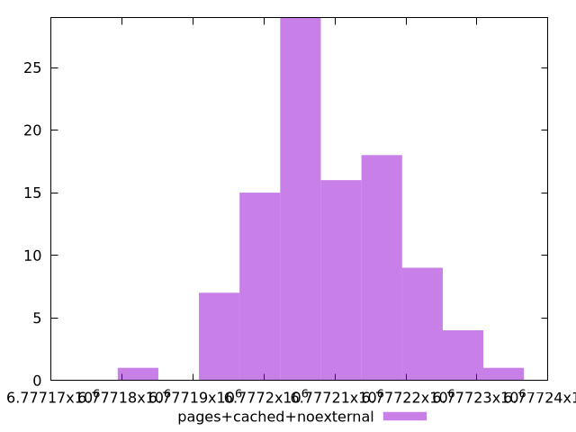

# Report pages+cached+noexternal

[parent..](./..)  


## Scores

  

## Score Histogram

  

## Score Indicators

```yaml
min: 0.05568279801498255
max: 0.05568552308658353
range: 0.000002725071600984119
mean: 0.05568415424839254
median: 0.05568421294026005
stdev: 4.858887421407628e-7
skewness: -0.02249707535159633

```

## Raw Values

  

## Raw Values Histogram

  

## Raw Indicators

```yaml
min: 6777183
max: 6777235
range: 52
mean: 6777209.12
median: 6777208
stdev: 9.271763586287122
skewness: 0.02252129065782906

```

<style>
  img {
    max-width: 80%;
  }
</style>
      
