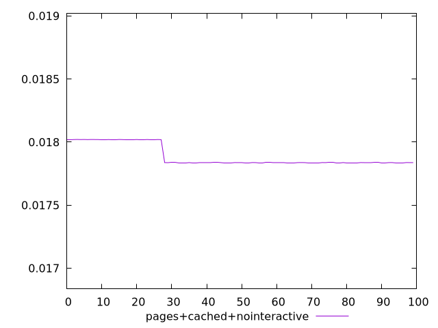
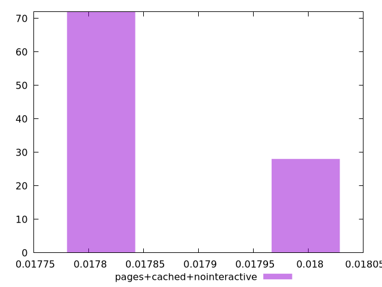
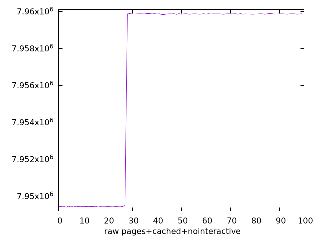
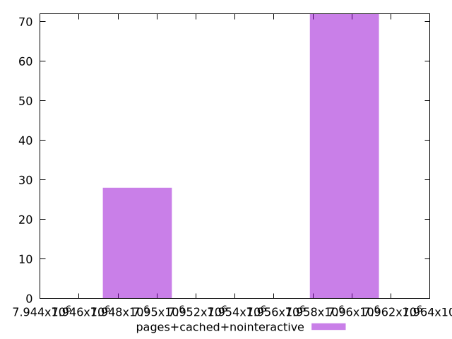

# Report pages+cached+nointeractive

[parent..](./..)  


## Scores

  

## Score Histogram

  

## Score Indicators

```yaml
min: 0.01783673205757219
max: 0.018020801008223397
range: 0.0001840689506512061
mean: 0.017888407241954424
median: 0.017837272928606623
stdev: 0.00008208698603542699
skewness: 0.9799573329314449

```

## Raw Values

  

## Raw Values Histogram

  

## Raw Indicators

```yaml
min: 7949397
max: 7959894
range: 10497
mean: 7956946.93
median: 7959863
stdev: 4681.254050476218
skewness: -0.9799570958628316

```

<style>
  img {
    max-width: 80%;
  }
</style>
      
