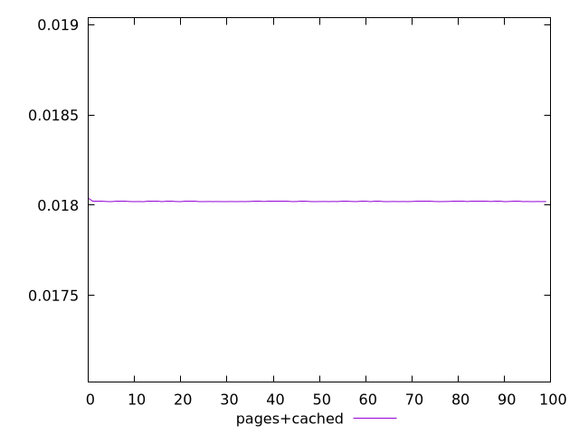
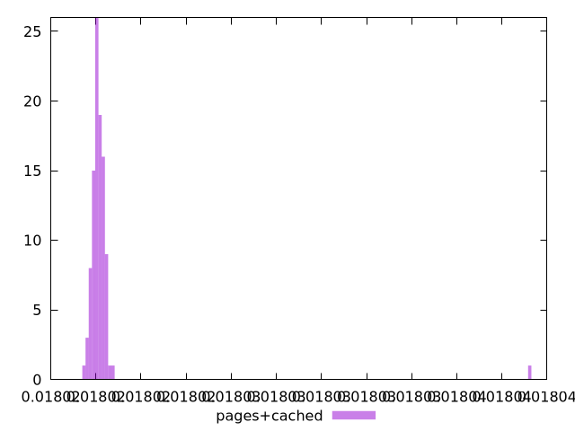
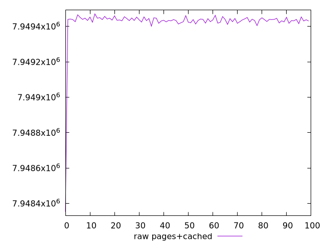
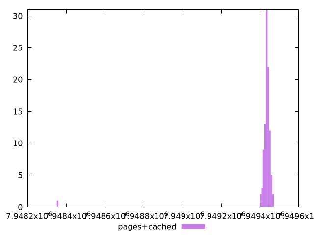

# Report pages+cached

[parent..](./..)  


## Scores

  

## Score Histogram

  

## Score Indicators

```yaml
min: 0.018019496888551867
max: 0.018039209542340395
range: 0.000019712653788528378
mean: 0.018020290904230456
median: 0.018020087255581546
stdev: 0.0000019152288351956887
skewness: 9.633246438211307

```

## Raw Values

  

## Raw Values Histogram

  

## Raw Indicators

```yaml
min: 7948353
max: 7949471
range: 1118
mean: 7949425.95
median: 7949437.5
stdev: 108.6209349066744
skewness: -9.633025723303922

```

<style>
  img {
    max-width: 80%;
  }
</style>
      
