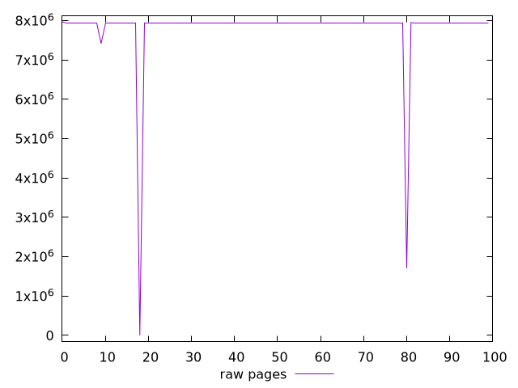

# Report pages

[parent..](./..)  


## Scores

  

## Score Histogram

  

## Score Indicators

```yaml
min: 0
max: 0.9972007732855122
range: 0.9972007732855122
mean: 0.027770030299053186
median: 0.01803984464836561
stdev: 0.09745577453608874
skewness: 9.84180576316585

```

## Raw Values

  

## Raw Values Histogram

  

## Raw Indicators

```yaml
min: 0
max: 7964829
range: 7964829
mean: 7801263.11
median: 7948317
stdev: 1001352.6102991184
skewness: -6.982200477978012

```

<style>
  img {
    max-width: 80%;
  }
</style>
      
