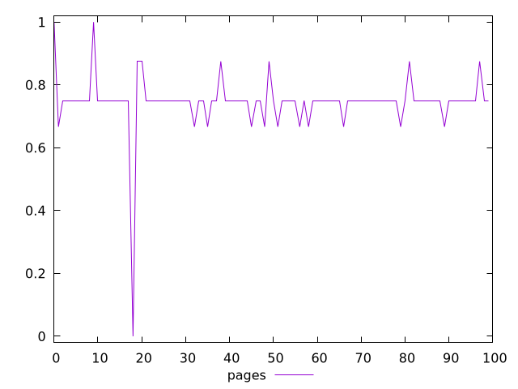
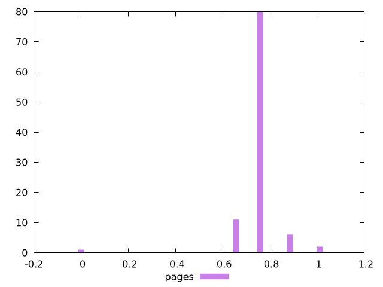
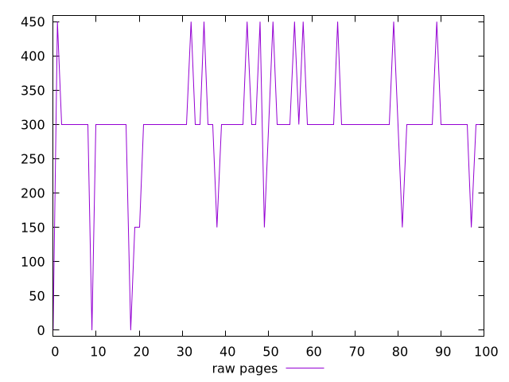
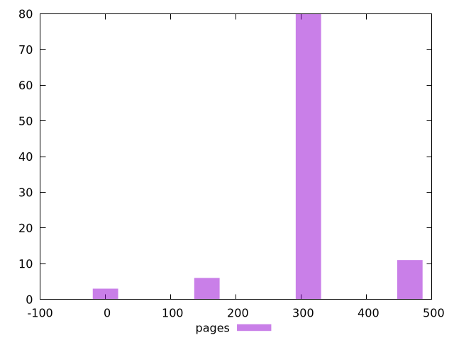

# Report pages

[parent..](./..)  


## Scores

  

## Score Histogram

  

## Score Indicators

```yaml
min: 0
max: 1
range: 1
mean: 0.7458333333333332
median: 0.75
stdev: 0.09251501379656046
skewness: -4.730332482144014

```

## Raw Values

  

## Raw Values Histogram

  

## Raw Indicators

```yaml
min: 0
max: 450
range: 450
mean: 298.5
median: 300
stdev: 80.76354375583082
skewness: -1.161529573921395

```

<style>
  img {
    max-width: 80%;
  }
</style>
      
