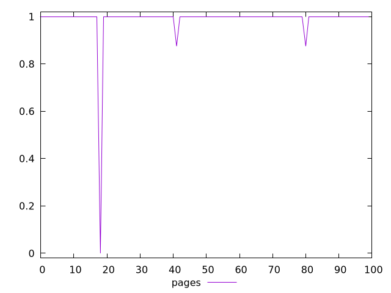
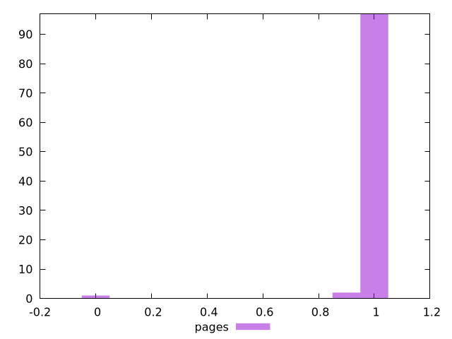
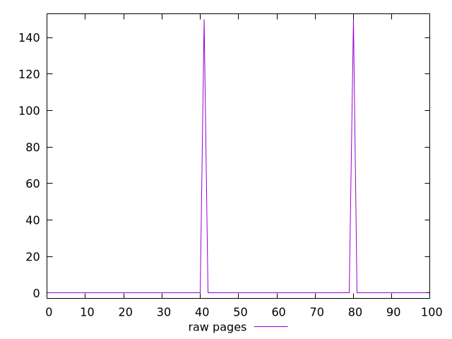
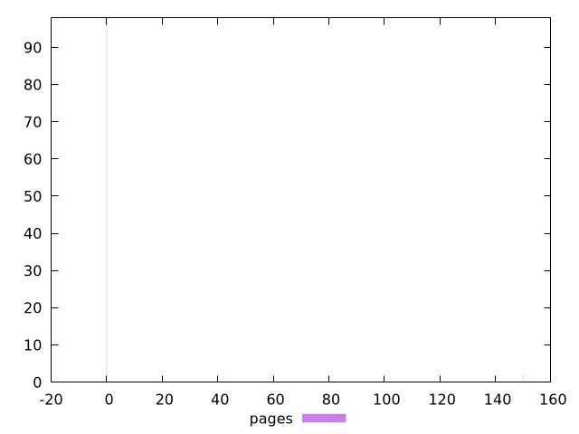

# Report pages

[parent..](./..)  


## Scores

  

## Score Histogram

  

## Score Indicators

```yaml
min: 0
max: 1
range: 1
mean: 0.9875
median: 1
stdev: 0.10077822185373193
skewness: -9.434272735523816

```

## Raw Values

  

## Raw Values Histogram

  

## Raw Indicators

```yaml
min: 0
max: 150
range: 150
mean: 3
median: 0
stdev: 21
skewness: 6.857142857142852

```

<style>
  img {
    max-width: 80%;
  }
</style>
      
