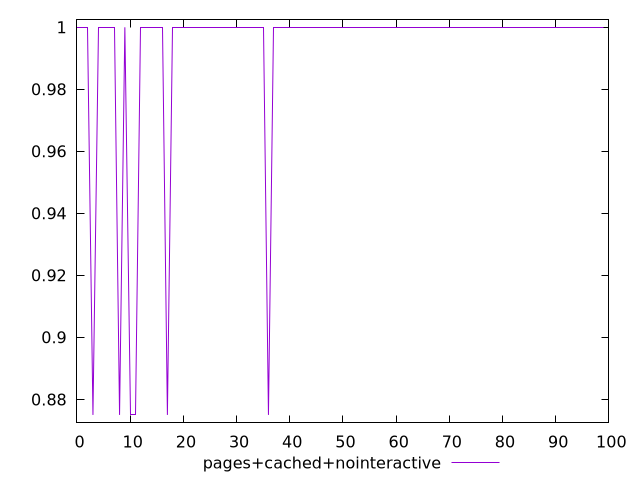
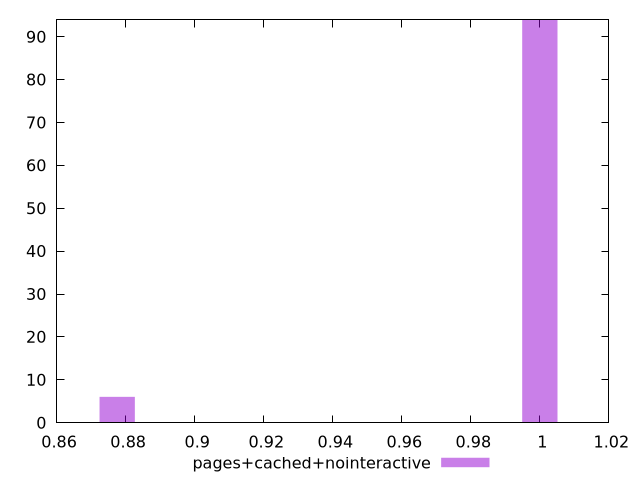
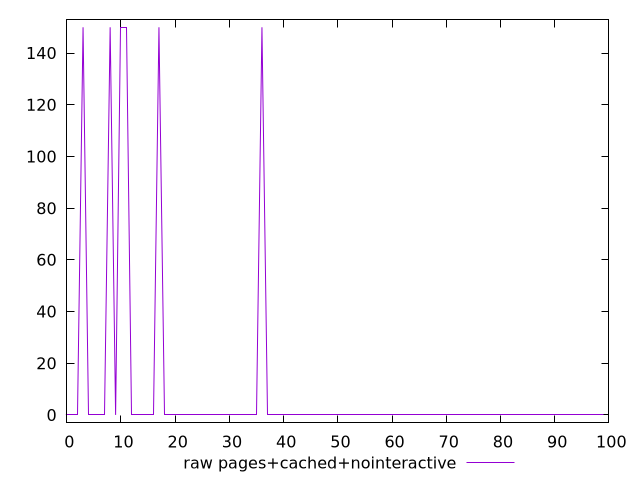
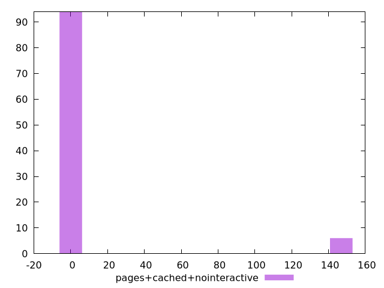

# Report pages+cached+nointeractive

[parent..](./..)  


## Scores

  

## Score Histogram

  

## Score Indicators

```yaml
min: 0.875
max: 1
range: 0.125
mean: 0.9925
median: 1
stdev: 0.029685855217594793
skewness: -3.7054684526926835

```

## Raw Values

  

## Raw Values Histogram

  

## Raw Indicators

```yaml
min: 0
max: 150
range: 150
mean: 9
median: 0
stdev: 35.62302626111375
skewness: 3.705468452692678

```

<style>
  img {
    max-width: 80%;
  }
</style>
      
