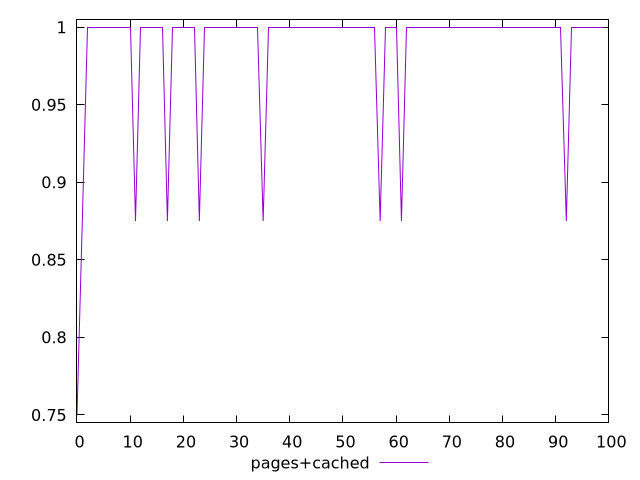
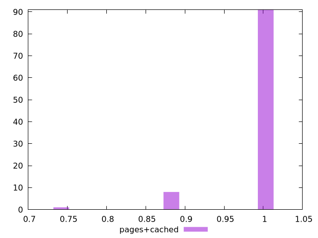
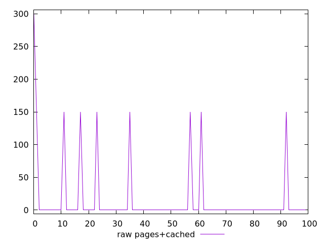
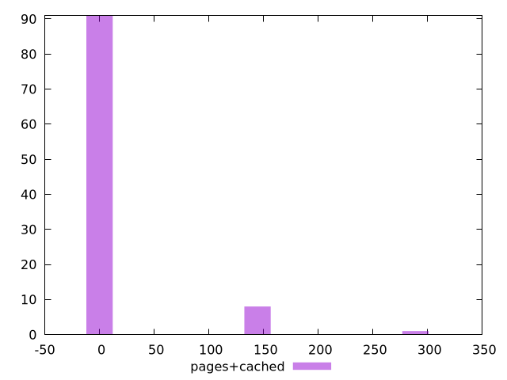

# Report pages+cached

[parent..](./..)  


## Scores

  

## Score Histogram

  

## Score Indicators

```yaml
min: 0.75
max: 1
range: 0.25
mean: 0.9875
median: 1
stdev: 0.04145780987944248
skewness: -3.4536754015271085

```

## Raw Values

  

## Raw Values Histogram

  

## Raw Indicators

```yaml
min: 0
max: 300
range: 300
mean: 15
median: 0
stdev: 49.749371855331
skewness: 3.453675401527102

```

<style>
  img {
    max-width: 80%;
  }
</style>
      
