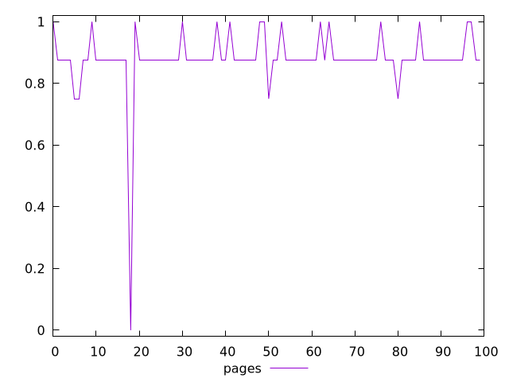
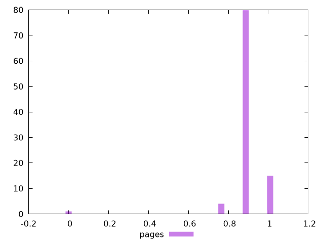
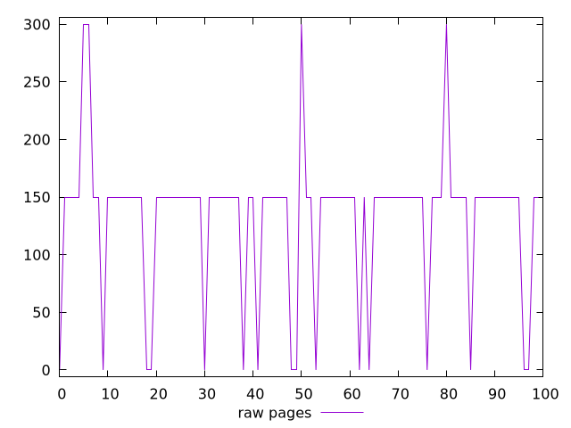
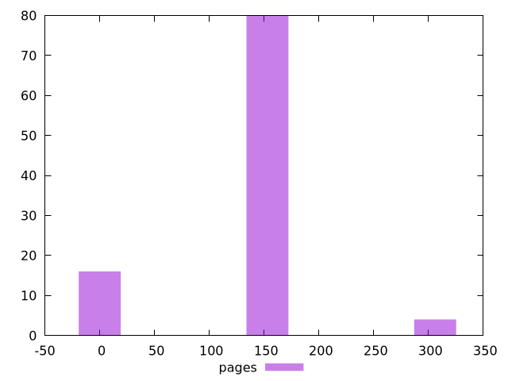

# Report pages

[parent..](./..)  


## Scores

  

## Score Histogram

  

## Score Indicators

```yaml
min: 0
max: 1
range: 1
mean: 0.88
median: 0.875
stdev: 0.10295630140986999
skewness: -6.0874883269533

```

## Raw Values

  

## Raw Values Histogram

  

## Raw Indicators

```yaml
min: 0
max: 300
range: 300
mean: 132
median: 150
stdev: 64.62197768561404
skewness: -0.6435303960963356

```

<style>
  img {
    max-width: 80%;
  }
</style>
      
