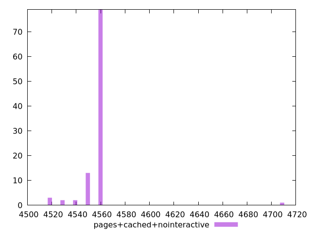

# Report pages+cached+nointeractive

[parent..](./..)  


## Scores

  

## Score Histogram

  

## Score Indicators

```yaml
min: 0.03411764705882353
max: 0.056470588235294106
range: 0.022352941176470575
mean: 0.05199999999999998
median: 0.051764705882352935
stdev: 0.0020646975029157905
skewness: -6.078390747009531

```

## Raw Values

  

## Raw Values Histogram

  

## Raw Indicators

```yaml
min: 4520
max: 4710
range: 190
mean: 4558
median: 4560
stdev: 17.549928774784245
skewness: 6.078390747009532

```

<style>
  img {
    max-width: 80%;
  }
</style>
      
