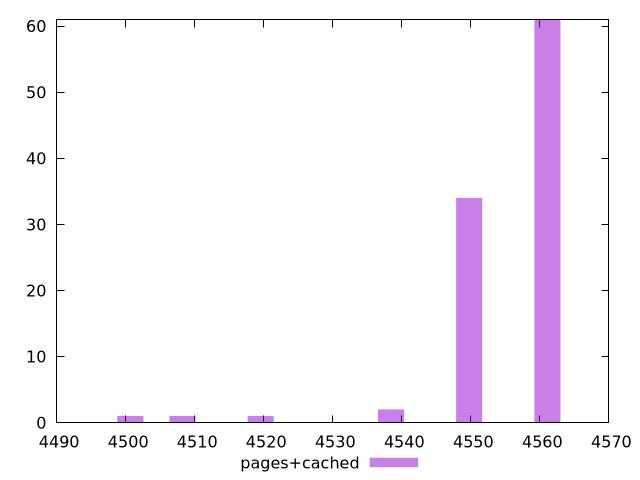

# Report pages+cached

[parent..](./..)  


## Scores

  

## Score Histogram

  

## Score Indicators

```yaml
min: 0.051764705882352935
max: 0.05882352941176472
range: 0.007058823529411784
mean: 0.052388235294117604
median: 0.051764705882352935
stdev: 0.0011217263018195498
skewness: 3.4098565260868368

```

## Raw Values

  

## Raw Values Histogram

  

## Raw Indicators

```yaml
min: 4500
max: 4560
range: 60
mean: 4554.7
median: 4560
stdev: 9.534673565466205
skewness: -3.4098565260866343

```

<style>
  img {
    max-width: 80%;
  }
</style>
      
