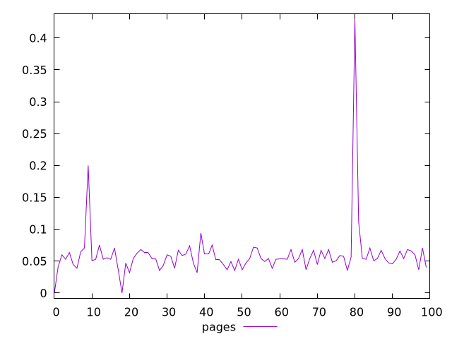
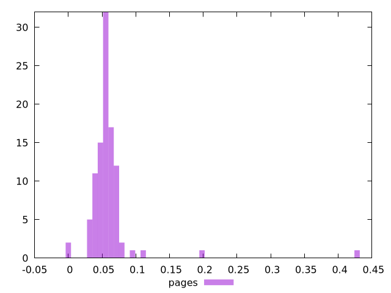
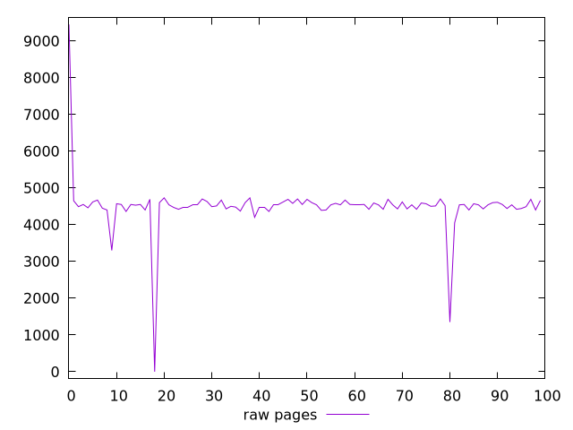
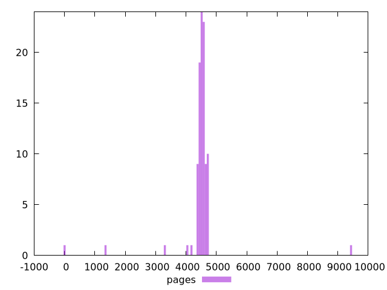

# Report pages

[parent..](./..)  


## Scores

  

## Score Histogram

  

## Score Indicators

```yaml
min: 0
max: 0.4294117647058824
range: 0.4294117647058824
mean: 0.05954117647058821
median: 0.05411764705882349
stdev: 0.04256154347176524
skewness: 6.865599807006367

```

## Raw Values

  

## Raw Values Histogram

  

## Raw Indicators

```yaml
min: 0
max: 9450
range: 9450
mean: 4488.4
median: 4540
stdev: 757.1706808903789
skewness: -0.01934329180262343

```

<style>
  img {
    max-width: 80%;
  }
</style>
      
