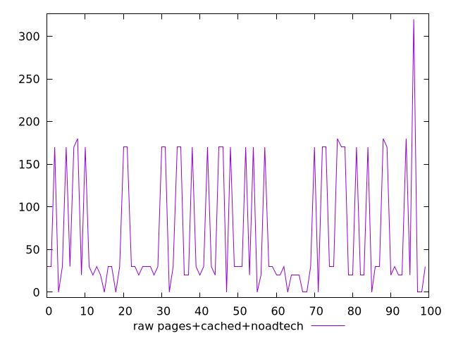

# Report pages+cached+noadtech

[parent..](./..)  


## Scores

  

## Score Histogram

  

## Score Indicators

```yaml
min: 0.7388888888888889
max: 1
range: 0.26111111111111107
mean: 0.9425555555555551
median: 0.975
stdev: 0.061373024596708195
skewness: -0.9502970465401868

```

## Raw Values

  

## Raw Values Histogram

  

## Raw Indicators

```yaml
min: 0
max: 320
range: 320
mean: 69
median: 30
stdev: 73.87151006985034
skewness: 0.9694261575797278

```

<style>
  img {
    max-width: 80%;
  }
</style>
      
