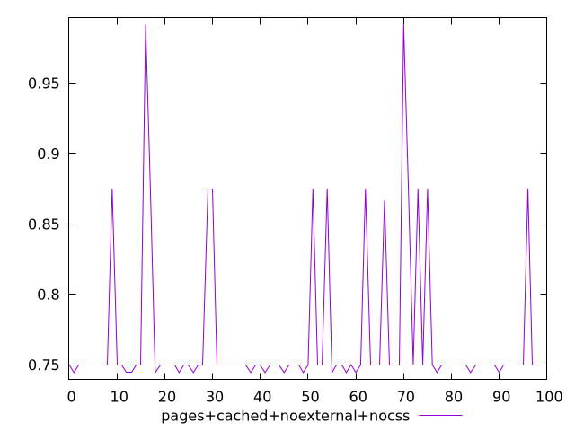
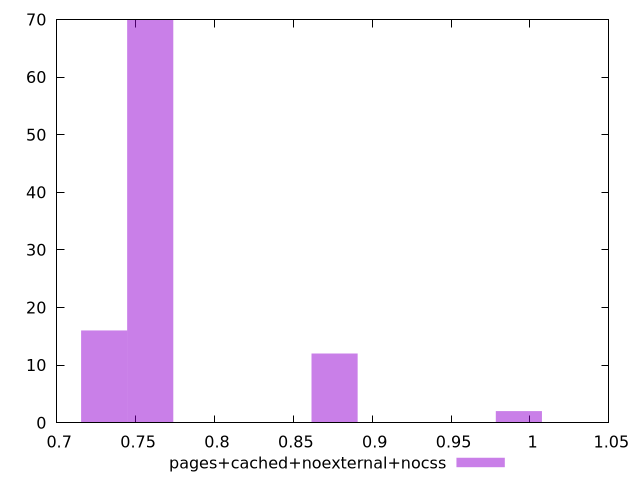
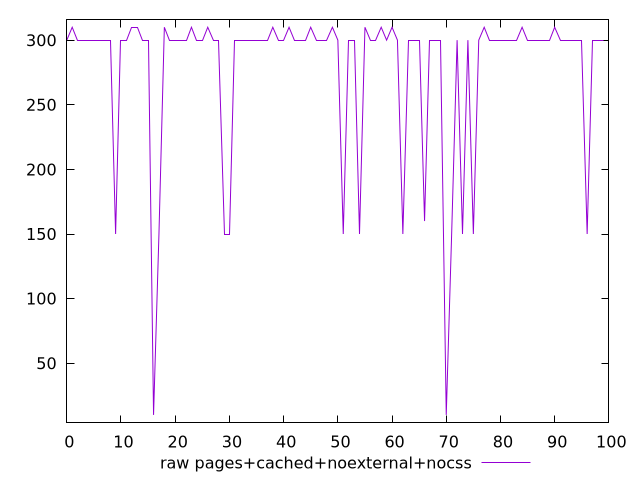
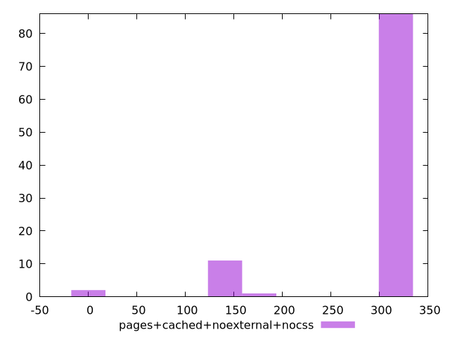

# Report pages+cached+noexternal+nocss

[parent..](./..)  


## Scores

  

## Score Histogram

  

## Score Indicators

```yaml
min: 0.7444444444444445
max: 0.9916666666666667
range: 0.24722222222222223
mean: 0.7688611111111112
median: 0.75
stdev: 0.05169248906684537
skewness: 2.5705778239860395

```

## Raw Values

  

## Raw Values Histogram

  

## Raw Indicators

```yaml
min: 10
max: 310
range: 300
mean: 277.9
median: 300
stdev: 62.29438176914507
skewness: -2.557440616590255

```

<style>
  img {
    max-width: 80%;
  }
</style>
      
