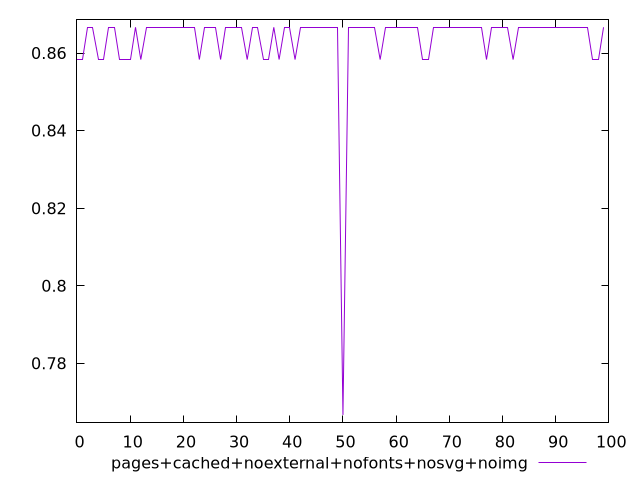
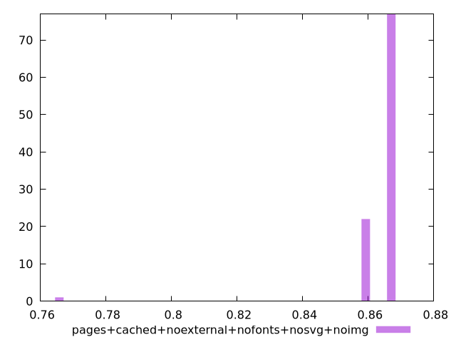
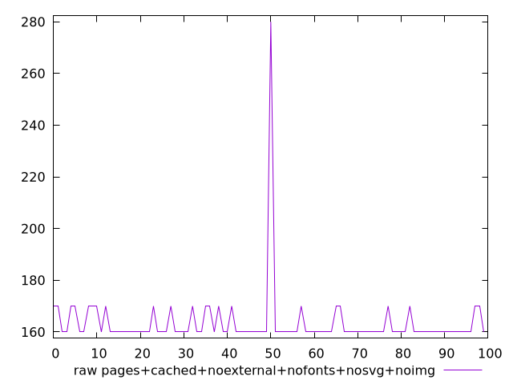
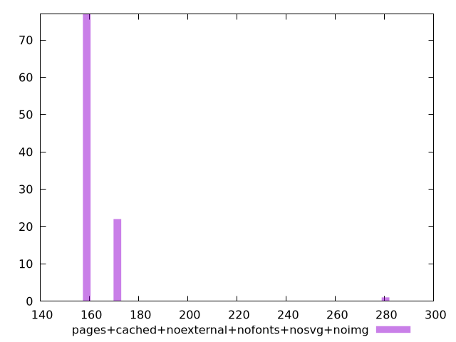

# Report pages+cached+noexternal+nofonts+nosvg+noimg

[parent..](./..)  


## Scores

  

## Score Histogram

  

## Score Indicators

```yaml
min: 0.7666666666666666
max: 0.8666666666666667
range: 0.10000000000000009
mean: 0.8638333333333327
median: 0.8666666666666667
stdev: 0.010356157588604002
skewness: -8.2767280221208

```

## Raw Values

  

## Raw Values Histogram

  

## Raw Indicators

```yaml
min: 160
max: 280
range: 120
mean: 163.4
median: 160
stdev: 12.427389106324778
skewness: 8.276728022121015

```

<style>
  img {
    max-width: 80%;
  }
</style>
      
