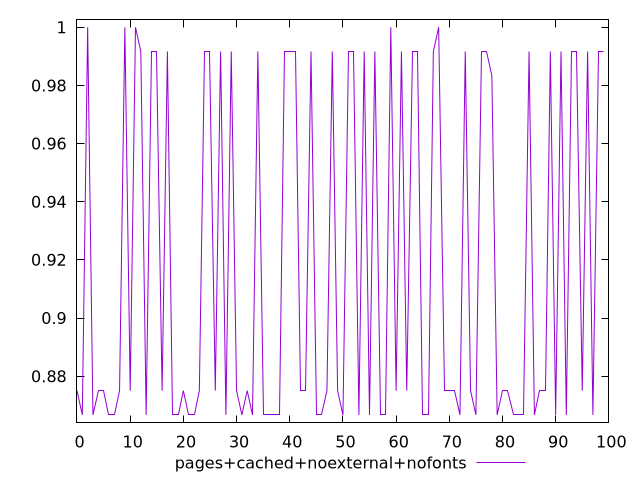
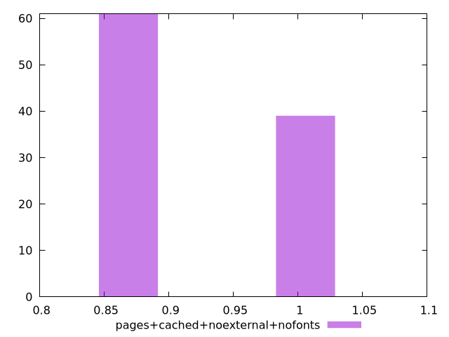
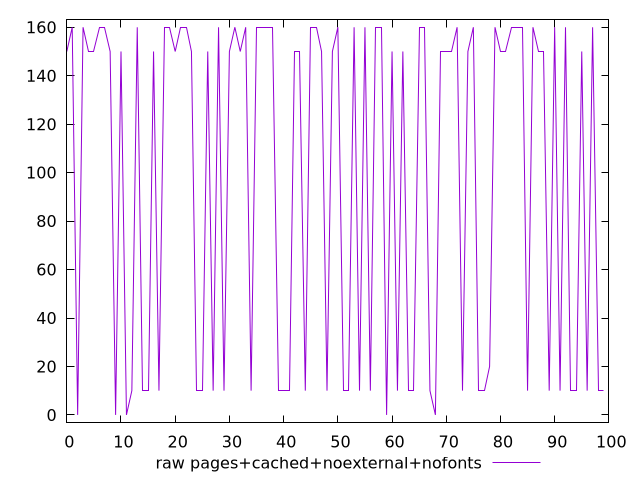
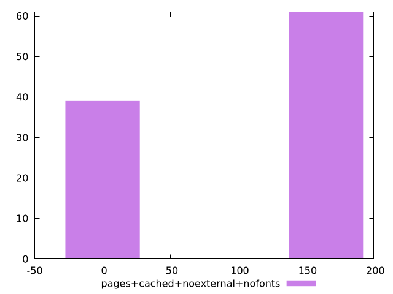

# Report pages+cached+noexternal+nofonts

[parent..](./..)  


## Scores

  

## Score Histogram

  

## Score Indicators

```yaml
min: 0.8666666666666667
max: 1
range: 0.1333333333333333
mean: 0.9179166666666657
median: 0.875
stdev: 0.05977242721820449
skewness: 0.4456034136272153

```

## Raw Values

  

## Raw Values Histogram

  

## Raw Indicators

```yaml
min: 0
max: 160
range: 160
mean: 98.5
median: 150
stdev: 71.72691266184542
skewness: -0.44560341362716654

```

<style>
  img {
    max-width: 80%;
  }
</style>
      
