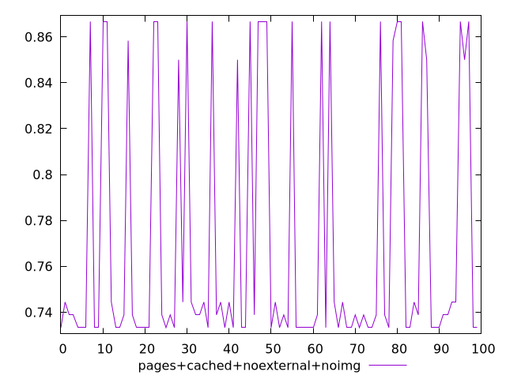

# Report pages+cached+noexternal+noimg

[parent..](./..)  


## Scores

  

## Score Histogram

  

## Score Indicators

```yaml
min: 0.7333333333333333
max: 0.8666666666666667
range: 0.13333333333333341
mean: 0.7696666666666668
median: 0.7388888888888889
stdev: 0.0558059357876544
skewness: 1.090027258468681

```

## Raw Values

  

## Raw Values Histogram

  

## Raw Indicators

```yaml
min: 160
max: 330
range: 170
mean: 282.3
median: 320
stdev: 70.62372122736095
skewness: -1.0744547273276481

```

<style>
  img {
    max-width: 80%;
  }
</style>
      
