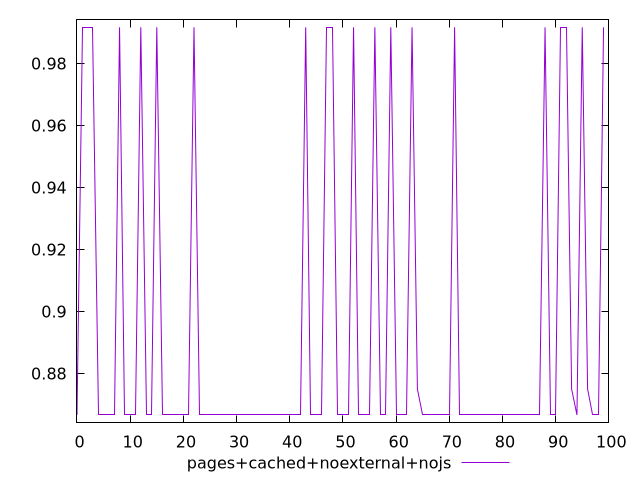
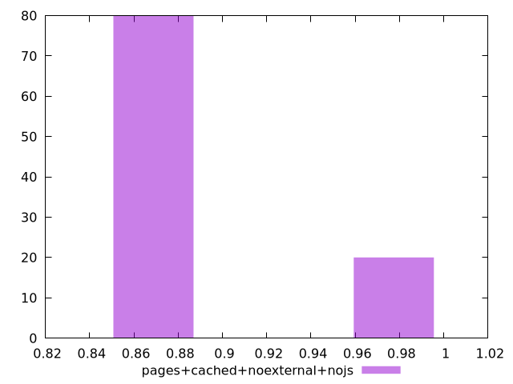
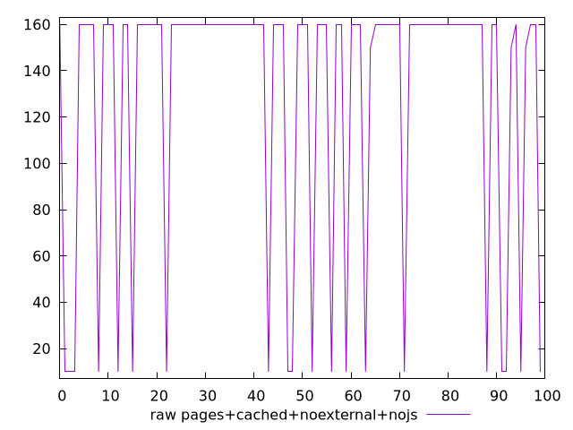
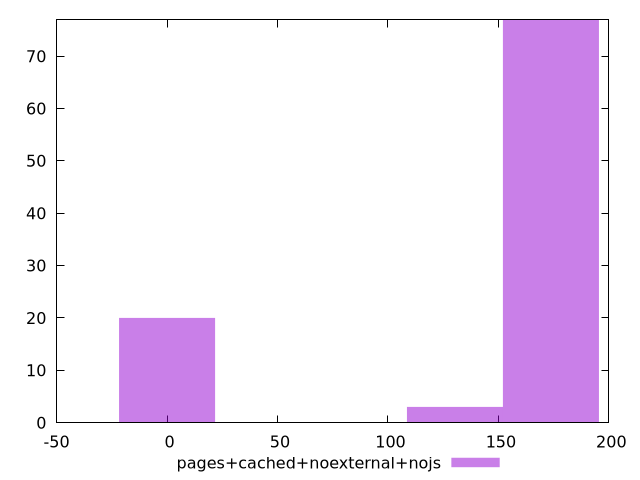

# Report pages+cached+noexternal+nojs

[parent..](./..)  


## Scores

  

## Score Histogram

  

## Score Indicators

```yaml
min: 0.8666666666666667
max: 0.9916666666666667
range: 0.125
mean: 0.891916666666665
median: 0.8666666666666667
stdev: 0.049895098289644946
skewness: 1.497104814419303

```

## Raw Values

  

## Raw Values Histogram

  

## Raw Indicators

```yaml
min: 10
max: 160
range: 150
mean: 129.7
median: 160
stdev: 59.87411794757397
skewness: -1.4971048144192014

```

<style>
  img {
    max-width: 80%;
  }
</style>
      
