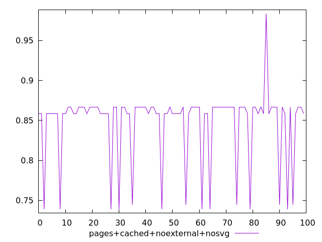
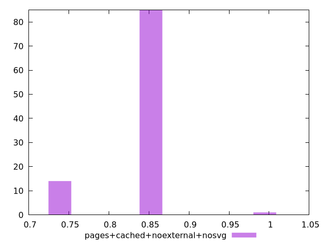
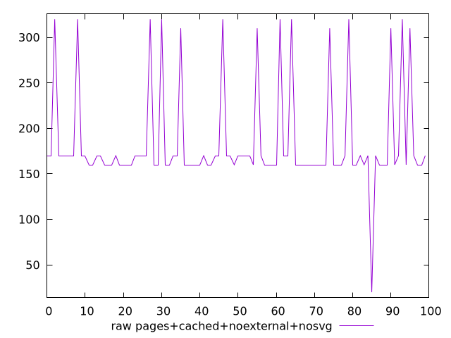
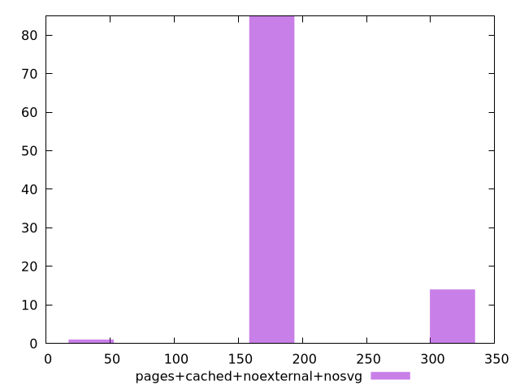

# Report pages+cached+noexternal+nosvg

[parent..](./..)  


## Scores

  

## Score Histogram

  

## Score Indicators

```yaml
min: 0.7388888888888889
max: 0.9833333333333333
range: 0.24444444444444435
mean: 0.8471388888888889
median: 0.8583333333333334
stdev: 0.0446858979467644
skewness: -1.5573075824980445

```

## Raw Values

  

## Raw Values Histogram

  

## Raw Indicators

```yaml
min: 20
max: 320
range: 300
mean: 184.2
median: 170
stdev: 55.464943883501846
skewness: 1.5988018551060665

```

<style>
  img {
    max-width: 80%;
  }
</style>
      
