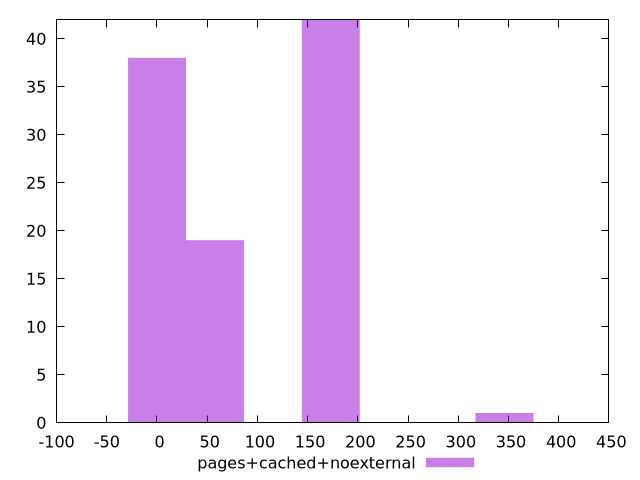

# Report pages+cached+noexternal

[parent..](./..)  


## Scores

  

## Score Histogram

  

## Score Indicators

```yaml
min: 0.7388888888888889
max: 1
range: 0.26111111111111107
mean: 0.9289722222222225
median: 0.975
stdev: 0.06523492091976042
skewness: -0.402515734193964

```

## Raw Values

  

## Raw Values Histogram

  

## Raw Indicators

```yaml
min: 0
max: 320
range: 320
mean: 85.3
median: 30
stdev: 78.47872323120454
skewness: 0.41911083674621763

```

<style>
  img {
    max-width: 80%;
  }
</style>
      
