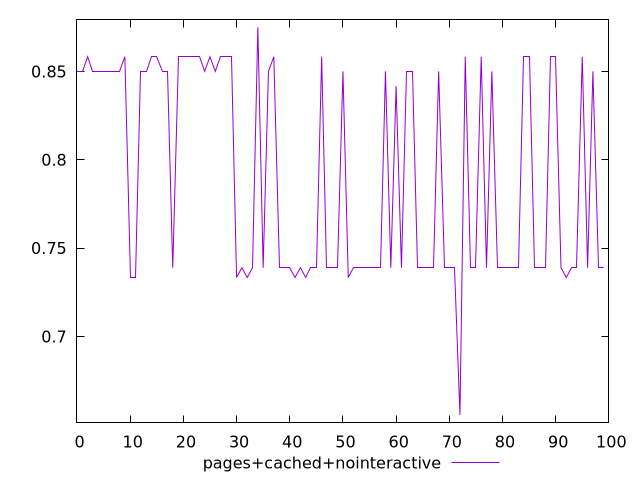
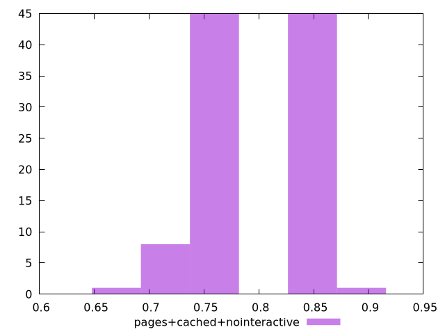
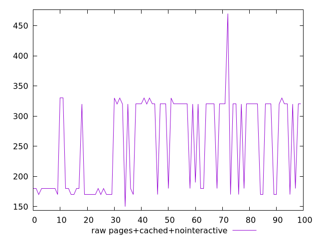
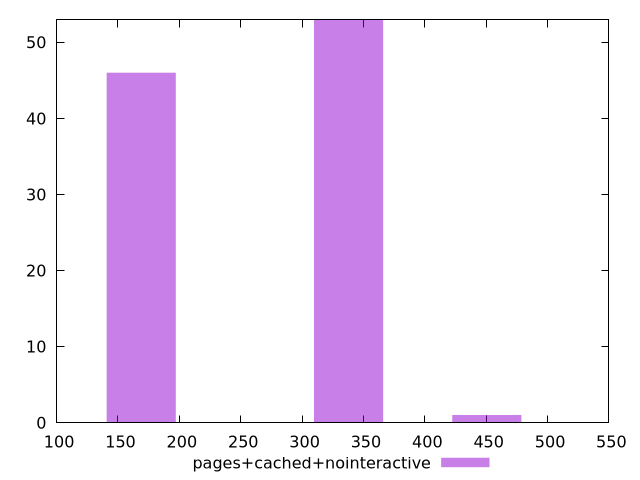

# Report pages+cached+nointeractive

[parent..](./..)  


## Scores

  

## Score Histogram

  

## Score Indicators

```yaml
min: 0.6555555555555556
max: 0.875
range: 0.21944444444444444
mean: 0.7907222222222215
median: 0.7388888888888889
stdev: 0.05942136104254214
skewness: 0.08886524498592721

```

## Raw Values

  

## Raw Values Histogram

  

## Raw Indicators

```yaml
min: 150
max: 470
range: 320
mean: 255.5
median: 320
stdev: 76.11011759286671
skewness: 0.013117310162753353

```

<style>
  img {
    max-width: 80%;
  }
</style>
      
