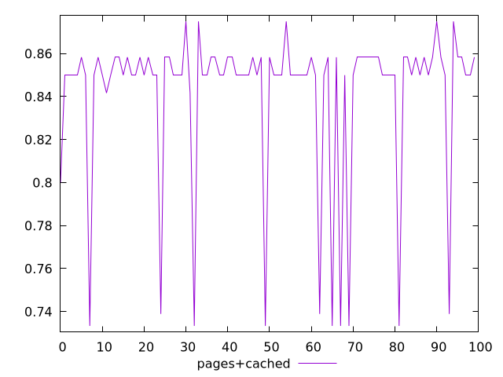
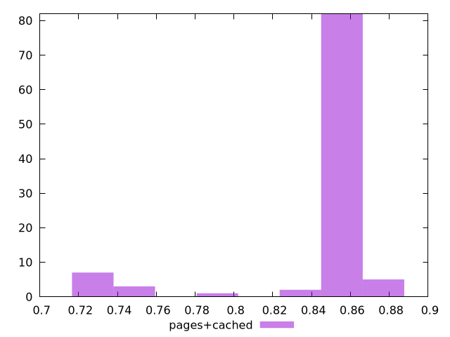
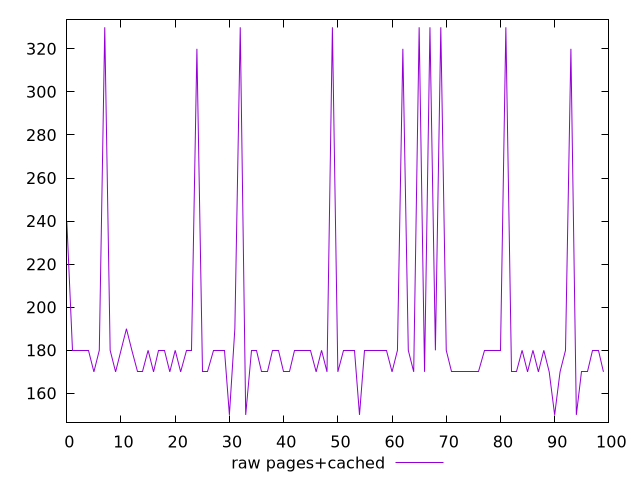
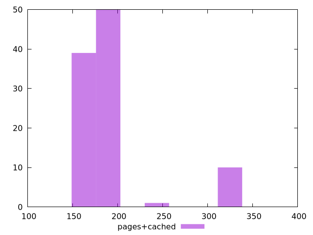

# Report pages+cached

[parent..](./..)  


## Scores

  

## Score Histogram

  

## Score Indicators

```yaml
min: 0.7333333333333333
max: 0.875
range: 0.14166666666666672
mean: 0.8419166666666666
median: 0.85
stdev: 0.036593139662652235
skewness: -2.440655214499213

```

## Raw Values

  

## Raw Values Histogram

  

## Raw Indicators

```yaml
min: 150
max: 330
range: 180
mean: 190.6
median: 180
stdev: 46.55792091577966
skewness: 2.466666962163318

```

<style>
  img {
    max-width: 80%;
  }
</style>
      
