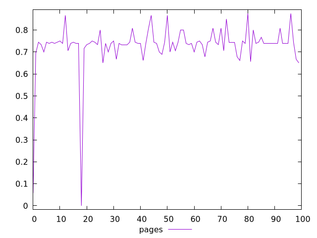
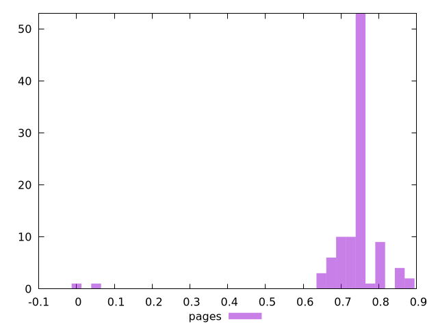
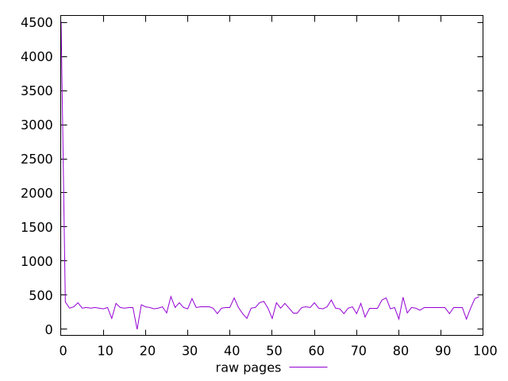
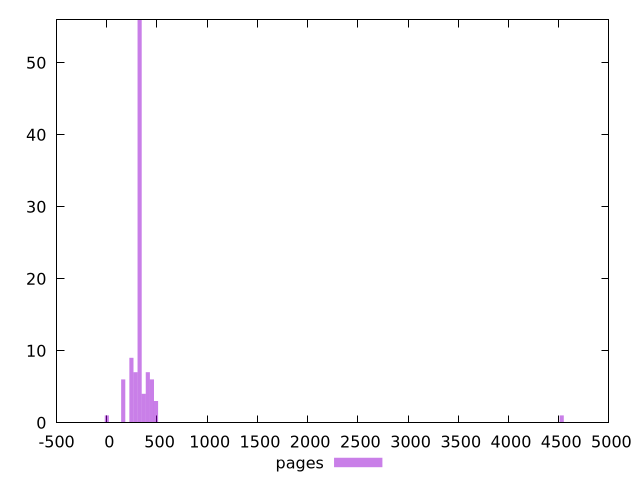

# Report pages

[parent..](./..)  


## Scores

  

## Score Histogram

  

## Score Indicators

```yaml
min: 0
max: 0.875
range: 0.875
mean: 0.7288820261437908
median: 0.7388888888888889
stdev: 0.10993100404473743
skewness: -5.063241973719703

```

## Raw Values

  

## Raw Values Histogram

  

## Raw Indicators

```yaml
min: 0
max: 4510
range: 4510
mean: 358.4
median: 320
stdev: 423.7988201965645
skewness: 9.386875376409856

```

<style>
  img {
    max-width: 80%;
  }
</style>
      
