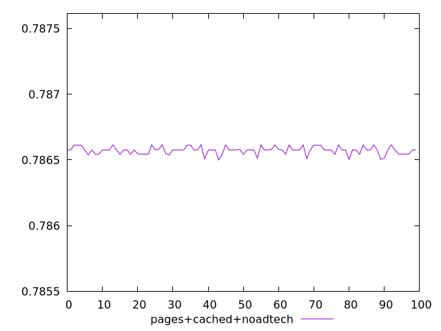

# Report pages+cached+noadtech

[parent..](./..)  


## Scores

  

## Score Histogram

  

## Score Indicators

```yaml
min: 0.786499404347403
max: 0.7866146671291339
range: 0.0001152627817309071
mean: 0.7865729789375405
median: 0.7865762442162387
stdev: 0.000029299340810593094
skewness: -0.4091535733046765

```

## Raw Values

  

## Raw Values Histogram

  

## Raw Indicators

```yaml
min: 51073
max: 51097
range: 24
mean: 51081.68
median: 51081
stdev: 6.100622919014087
skewness: 0.4092554131200259

```

<style>
  img {
    max-width: 80%;
  }
</style>
      
