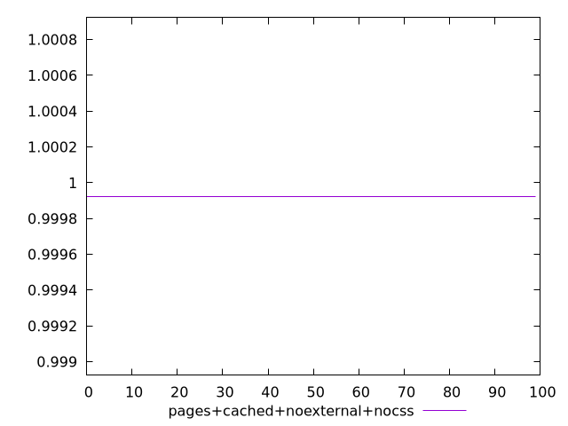
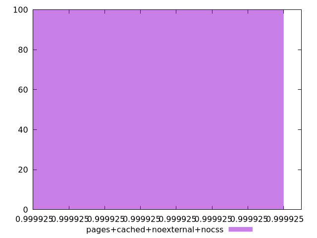
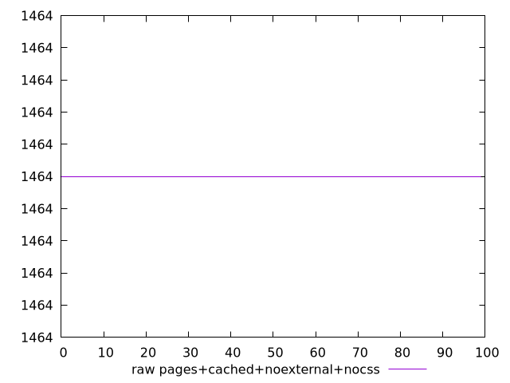
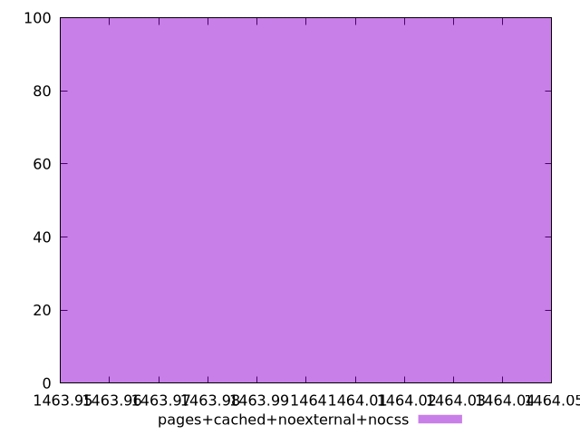

# Report pages+cached+noexternal+nocss

[parent..](./..)  


## Scores

  

## Score Histogram

  

## Score Indicators

```yaml
min: 0.9999246292865362
max: 0.9999246292865362
range: 0
mean: 0.9999246292865382
median: 0.9999246292865362
stdev: 1.9984014443252818e-15
skewness: -1

```

## Raw Values

  

## Raw Values Histogram

  

## Raw Indicators

```yaml
min: 1464
max: 1464
range: 0
mean: 1464
median: 1464
stdev: 0
skewness: .nan

```

<style>
  img {
    max-width: 80%;
  }
</style>
      
