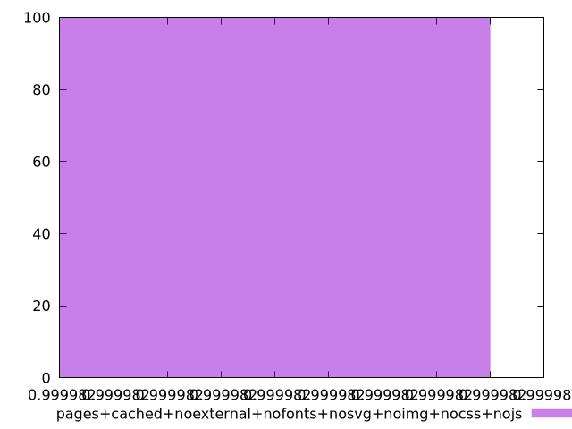
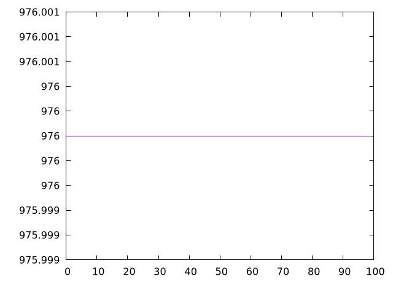

# Report pages+cached+noexternal+nofonts+nosvg+noimg+nocss+nojs

[parent..](./..)  


## Scores

  

## Score Histogram

  

## Score Indicators

```yaml
min: 0.9999819950158803
max: 0.9999819950158803
range: 0
mean: 0.999981995015882
median: 0.9999819950158803
stdev: 1.7763568394002505e-15
skewness: -1

```

## Raw Values

  

## Raw Values Histogram

  

## Raw Indicators

```yaml
min: 976
max: 976
range: 0
mean: 976
median: 976
stdev: 0
skewness: .nan

```

<style>
  img {
    max-width: 80%;
  }
</style>
      
