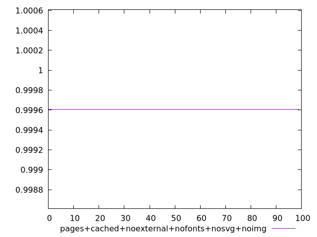
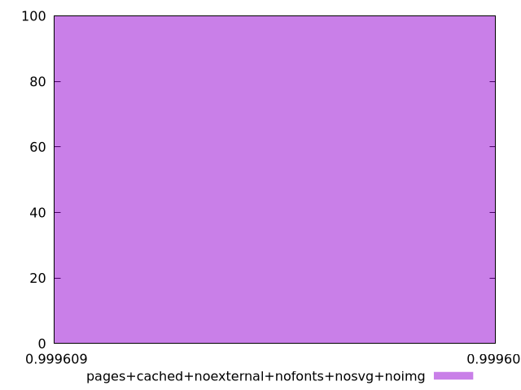
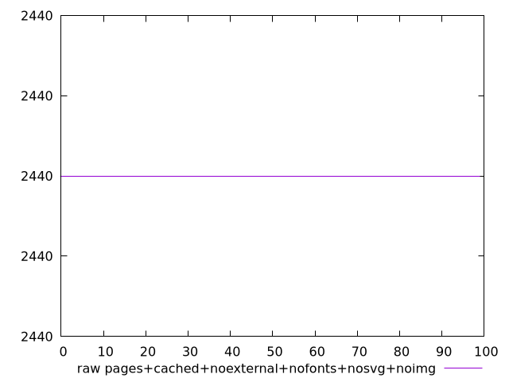
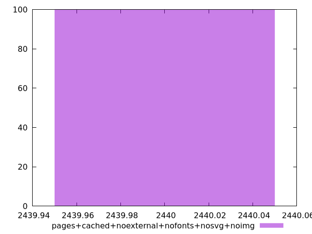

# Report pages+cached+noexternal+nofonts+nosvg+noimg

[parent..](./..)  


## Scores

  

## Score Histogram

  

## Score Indicators

```yaml
min: 0.9996090852968826
max: 0.9996090852968826
range: 0
mean: 0.9996090852968821
median: 0.9996090852968826
stdev: 5.551115123125783e-16
skewness: 1

```

## Raw Values

  

## Raw Values Histogram

  

## Raw Indicators

```yaml
min: 2440
max: 2440
range: 0
mean: 2440
median: 2440
stdev: 0
skewness: .nan

```

<style>
  img {
    max-width: 80%;
  }
</style>
      
