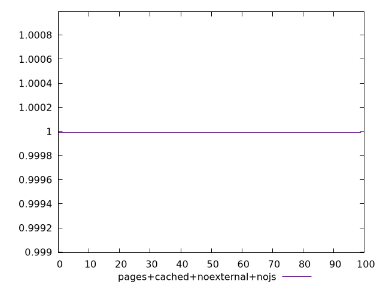
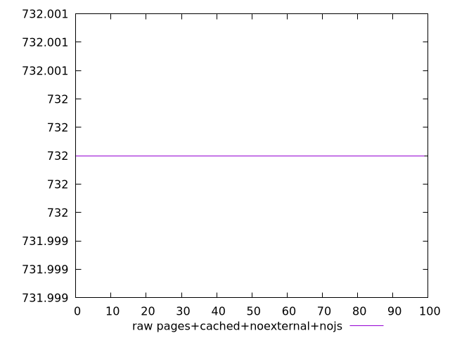
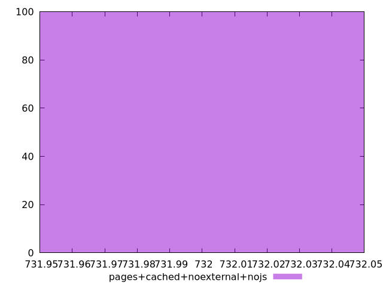

# Report pages+cached+noexternal+nojs

[parent..](./..)  


## Scores

  

## Score Histogram

  

## Score Indicators

```yaml
min: 0.9999939069787662
max: 0.9999939069787662
range: 0
mean: 0.9999939069787683
median: 0.9999939069787662
stdev: 2.1094237467877974e-15
skewness: -1

```

## Raw Values

  

## Raw Values Histogram

  

## Raw Indicators

```yaml
min: 732
max: 732
range: 0
mean: 732
median: 732
stdev: 0
skewness: .nan

```

<style>
  img {
    max-width: 80%;
  }
</style>
      
