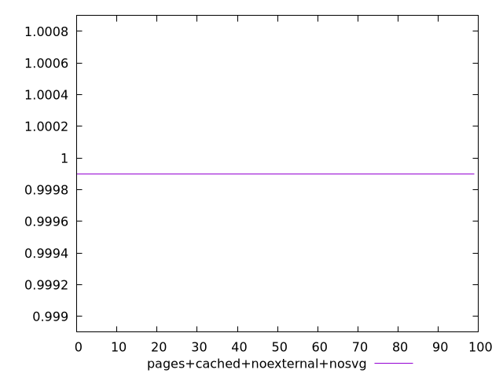
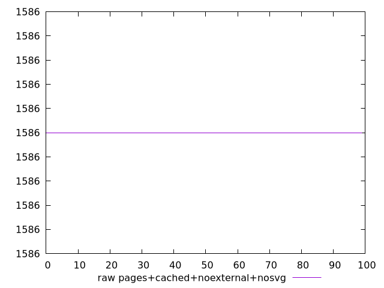

# Report pages+cached+noexternal+nosvg

[parent..](./..)  


## Scores

  

## Score Histogram

  

## Score Indicators

```yaml
min: 0.9999013149726905
max: 0.9999013149726905
range: 0
mean: 0.9999013149726895
median: 0.9999013149726905
stdev: 9.992007221626409e-16
skewness: 1

```

## Raw Values

  

## Raw Values Histogram

  

## Raw Indicators

```yaml
min: 1586
max: 1586
range: 0
mean: 1586
median: 1586
stdev: 0
skewness: .nan

```

<style>
  img {
    max-width: 80%;
  }
</style>
      
