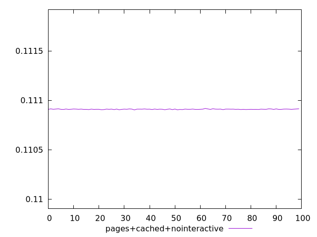
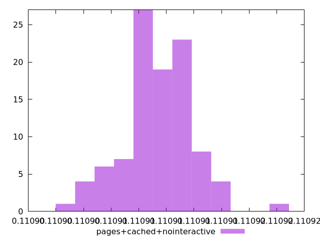
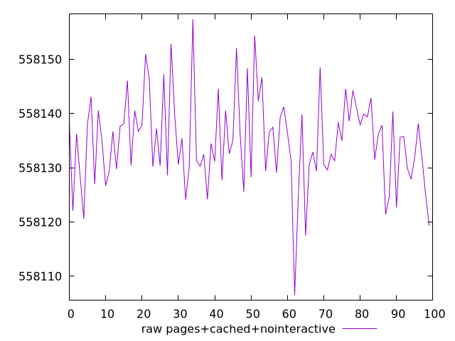
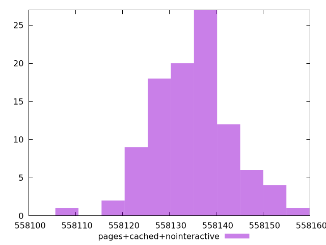

# Report pages+cached+nointeractive

[parent..](./..)  


## Scores

  

## Score Histogram

  

## Score Indicators

```yaml
min: 0.11090296610031497
max: 0.11091748398126988
range: 0.0000145178809549118
mean: 0.1109094008460141
median: 0.1109092960107187
stdev: 0.0000024085842299941884
skewness: -0.00004469211114599858

```

## Raw Values

  

## Raw Values Histogram

  

## Raw Indicators

```yaml
min: 558106.5708240224
max: 558157.3741759778
range: 50.80335195537191
mean: 558134.8556284605
median: 558135.2223603353
stdev: 8.428601694692873
skewness: 0.00016868833724765331

```

<style>
  img {
    max-width: 80%;
  }
</style>
      
