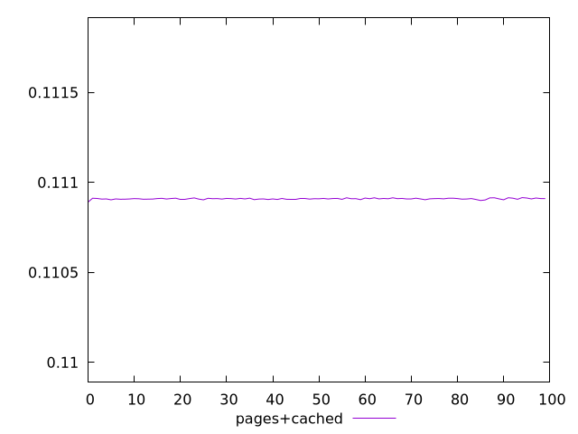
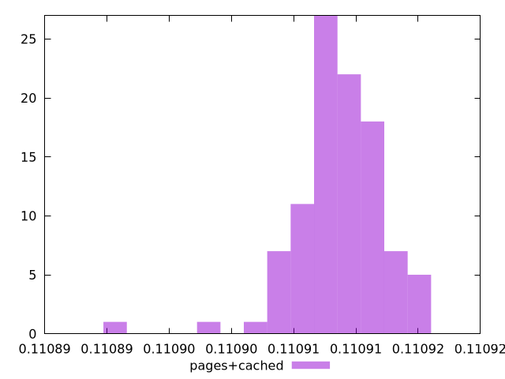
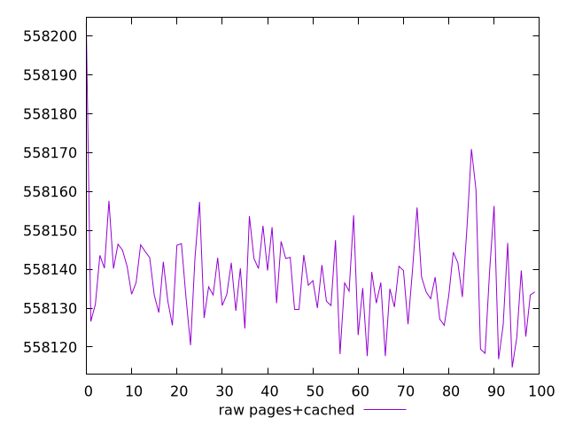
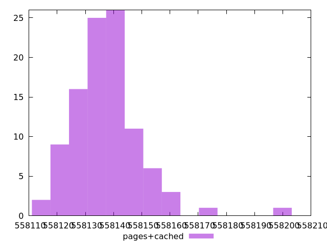

# Report pages+cached

[parent..](./..)  


## Scores

  

## Score Histogram

  

## Score Indicators

```yaml
min: 0.1108899210629608
max: 0.11091514131512037
range: 0.000025220252159563472
mean: 0.11090863012083363
median: 0.11090890971298129
stdev: 0.0000035332688222744974
skewness: -1.5475684826417335

```

## Raw Values

  

## Raw Values Histogram

  

## Raw Indicators

```yaml
min: 558114.7680307264
max: 558203.0315207946
range: 88.26349006826058
mean: 558137.5528668839
median: 558136.5741759777
stdev: 12.364875558973708
skewness: 1.5479830136085593

```

<style>
  img {
    max-width: 80%;
  }
</style>
      
