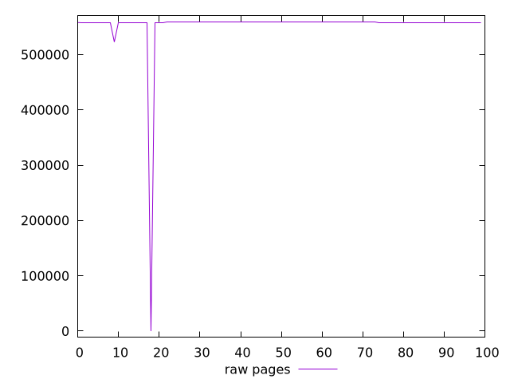

# Report pages

[parent..](./..)  


## Scores

  

## Score Histogram

  

## Score Indicators

```yaml
min: 0
max: 0.121658158336162
range: 0.121658158336162
mean: 0.10977012828104121
median: 0.11076908237763744
stdev: 0.011086507365389676
skewness: -9.693524755260816

```

## Raw Values

  

## Raw Values Histogram

  

## Raw Indicators

```yaml
min: 0
max: 559600.3029096834
range: 559600.3029096834
mean: 552684.0099730175
median: 558608.2795763501
stdev: 55663.13605301109
skewness: -9.78906553622175

```

<style>
  img {
    max-width: 80%;
  }
</style>
      
