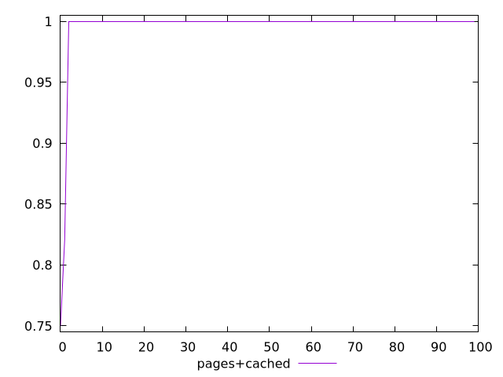
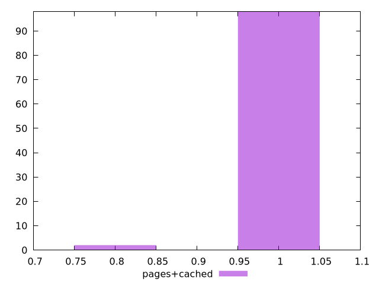
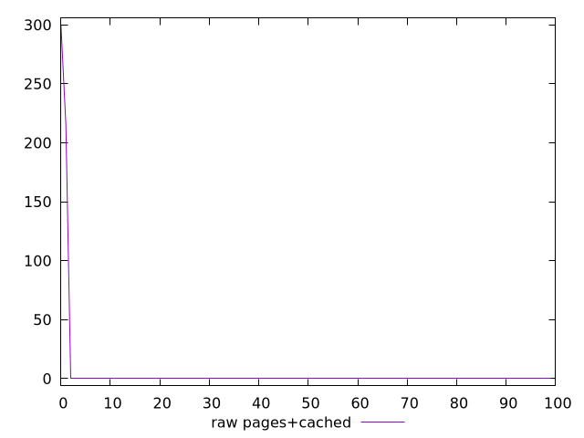
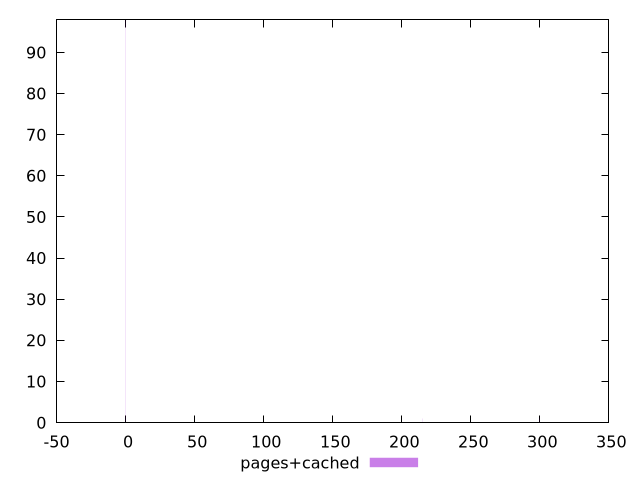

# Report pages+cached

[parent..](./..)  


## Scores

  

## Score Histogram

  

## Score Indicators

```yaml
min: 0.75
max: 1
range: 0.25
mean: 0.9957070499976476
median: 1
stdev: 0.030463708759290102
skewness: -7.139928644706967

```

## Raw Values

  

## Raw Values Histogram

  

## Raw Indicators

```yaml
min: 0
max: 300
range: 300
mean: 5.151540002822876
median: 0
stdev: 36.55645051114812
skewness: 7.13992864470697

```

<style>
  img {
    max-width: 80%;
  }
</style>
      
