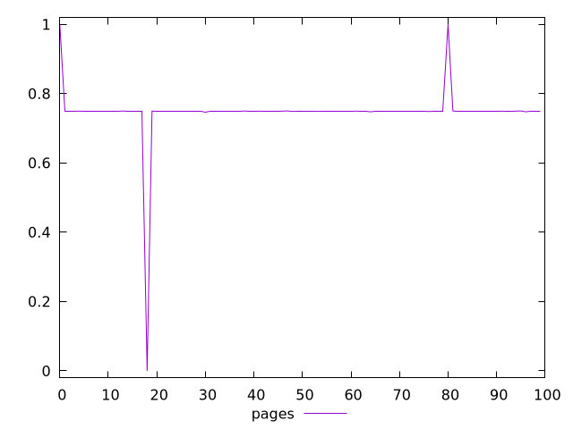
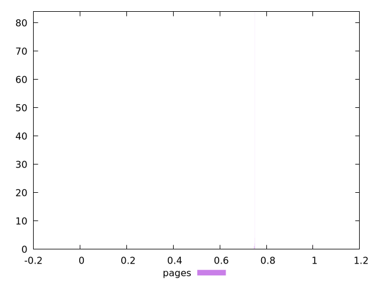
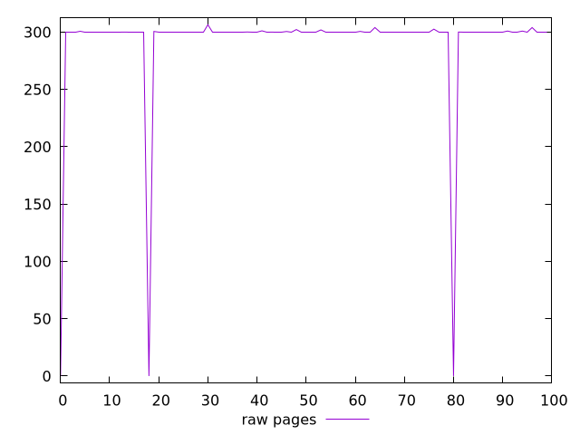
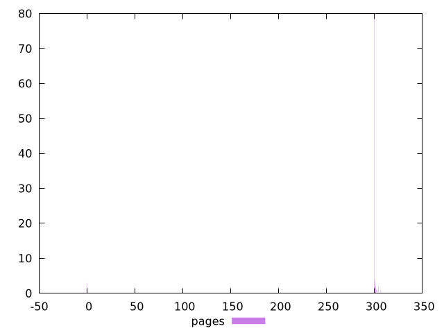

# Report pages

[parent..](./..)  


## Scores

  

## Score Histogram

  

## Score Indicators

```yaml
min: 0
max: 1
range: 1
mean: 0.7473462777777777
median: 0.75
stdev: 0.08287493510242697
skewness: -6.766533677656636

```

## Raw Values

  

## Raw Values Histogram

  

## Raw Indicators

```yaml
min: 0
max: 306.51800000000003
range: 306.51800000000003
mean: 291.2767
median: 300
stdev: 51.23345267566884
skewness: -5.507389780531231

```

<style>
  img {
    max-width: 80%;
  }
</style>
      
