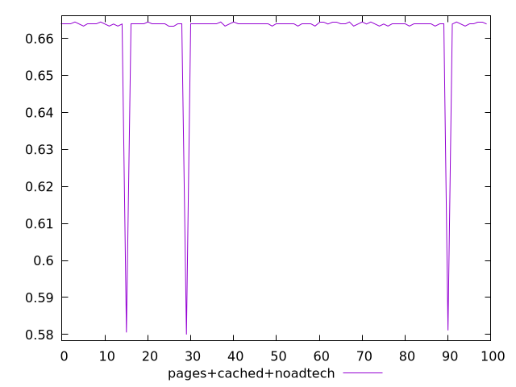
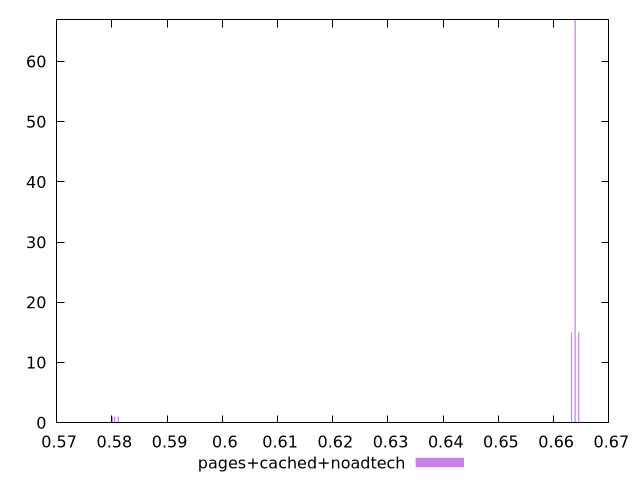
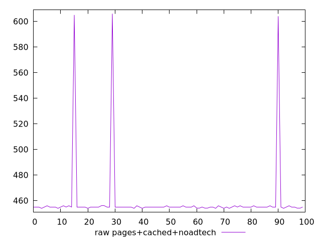
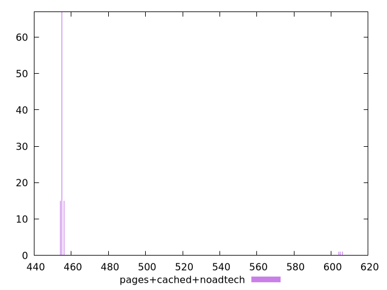

# Report pages+cached+noadtech

[parent..](./..)  


## Scores

  

## Score Histogram

  

## Score Indicators

```yaml
min: 0.58
max: 0.6644444444444444
range: 0.08444444444444443
mean: 0.6613888888888898
median: 0.6638888888888889
stdev: 0.01421907517264861
skewness: -5.506619508896145

```

## Raw Values

  

## Raw Values Histogram

  

## Raw Indicators

```yaml
min: 454
max: 606
range: 152
mean: 459.5
median: 455
stdev: 25.594335310767498
skewness: 5.506619508895945

```

<style>
  img {
    max-width: 80%;
  }
</style>
      
