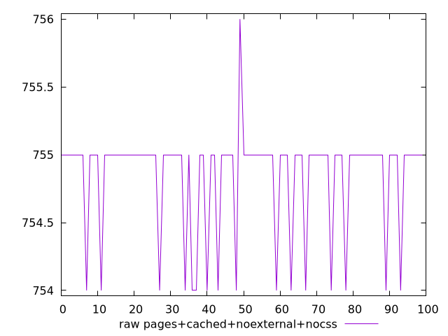

# Report pages+cached+noexternal+nocss

[parent..](./..)  


## Scores

  

## Score Histogram

  

## Score Indicators

```yaml
min: 0.49929411764705883
max: 0.4995294117647059
range: 0.00023529411764705577
mean: 0.4994294117647061
median: 0.49941176470588233
stdev: 0.00004518321028158848
skewness: 1.4166318787918175

```

## Raw Values

  

## Raw Values Histogram

  

## Raw Indicators

```yaml
min: 754
max: 756
range: 2
mean: 754.85
median: 755
stdev: 0.3840572873934307
skewness: -1.4166318788084586

```

<style>
  img {
    max-width: 80%;
  }
</style>
      
