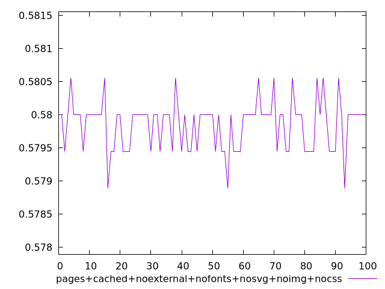

# Report pages+cached+noexternal+nofonts+nosvg+noimg+nocss

[parent..](./..)  


## Scores

  

## Score Histogram

  

## Score Indicators

```yaml
min: 0.5788888888888889
max: 0.5805555555555555
range: 0.0016666666666665941
mean: 0.5798499999999995
median: 0.58
stdev: 0.0003672974372458865
skewness: -0.2639123776455087

```

## Raw Values

  

## Raw Values Histogram

  

## Raw Indicators

```yaml
min: 605
max: 608
range: 3
mean: 606.27
median: 606
stdev: 0.6611353870426238
skewness: 0.2639123776491376

```

<style>
  img {
    max-width: 80%;
  }
</style>
      
