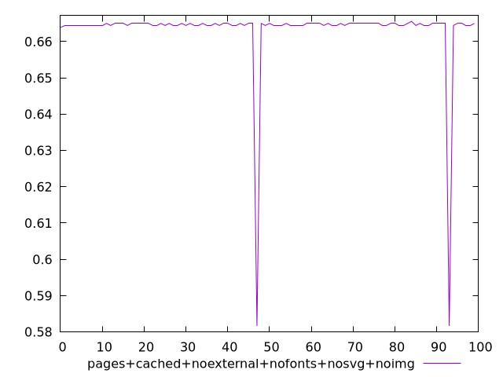
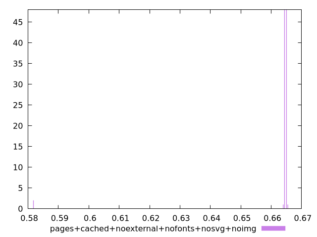
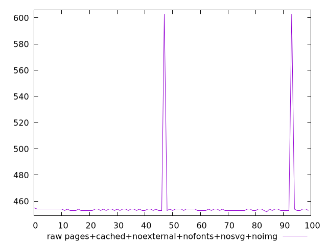
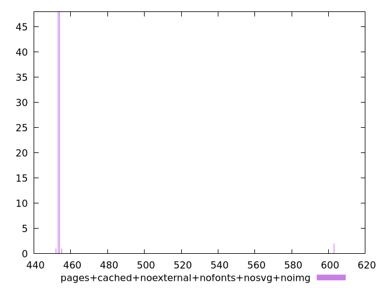

# Report pages+cached+noexternal+nofonts+nosvg+noimg

[parent..](./..)  


## Scores

  

## Score Histogram

  

## Score Indicators

```yaml
min: 0.5816666666666667
max: 0.6655555555555556
range: 0.0838888888888889
mean: 0.6630611111111102
median: 0.6644444444444444
stdev: 0.011631559612207899
skewness: -6.850177975468232

```

## Raw Values

  

## Raw Values Histogram

  

## Raw Indicators

```yaml
min: 452
max: 603
range: 151
mean: 456.49
median: 454
stdev: 20.936807301974213
skewness: 6.850177975468464

```

<style>
  img {
    max-width: 80%;
  }
</style>
      
