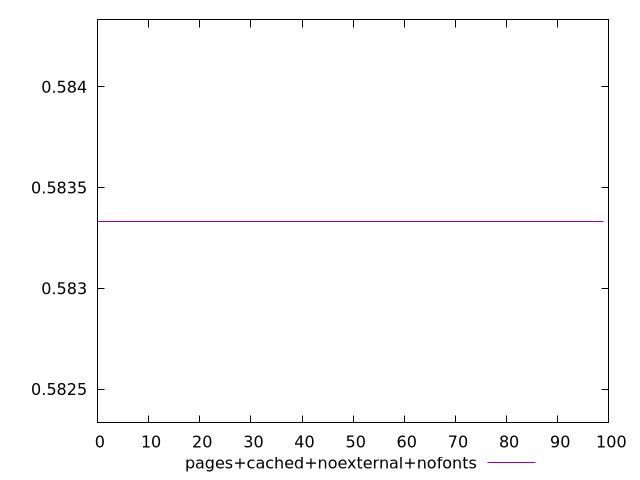
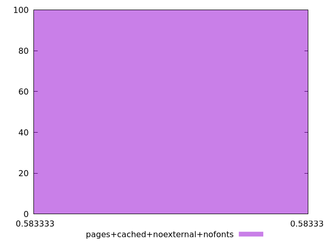
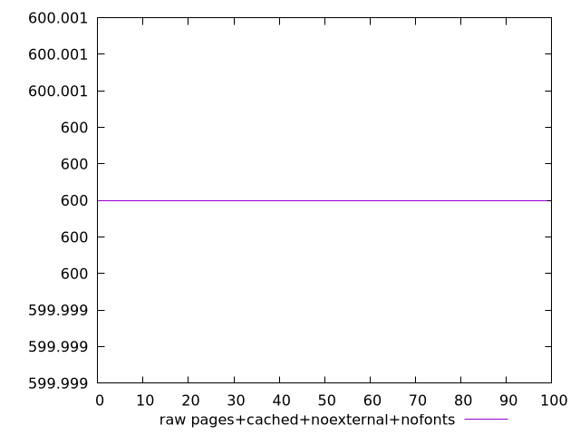
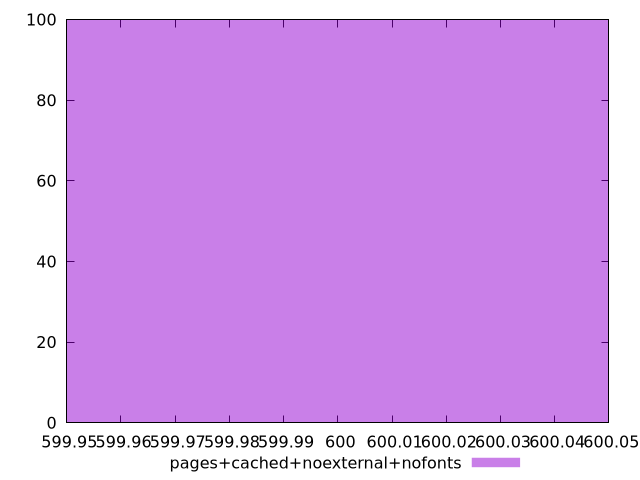

# Report pages+cached+noexternal+nofonts

[parent..](./..)  


## Scores

  

## Score Histogram

  

## Score Indicators

```yaml
min: 0.5833333333333334
max: 0.5833333333333334
range: 0
mean: 0.5833333333333341
median: 0.5833333333333334
stdev: 7.771561172376096e-16
skewness: -1

```

## Raw Values

  

## Raw Values Histogram

  

## Raw Indicators

```yaml
min: 600
max: 600
range: 0
mean: 600
median: 600
stdev: 0
skewness: .nan

```

<style>
  img {
    max-width: 80%;
  }
</style>
      
